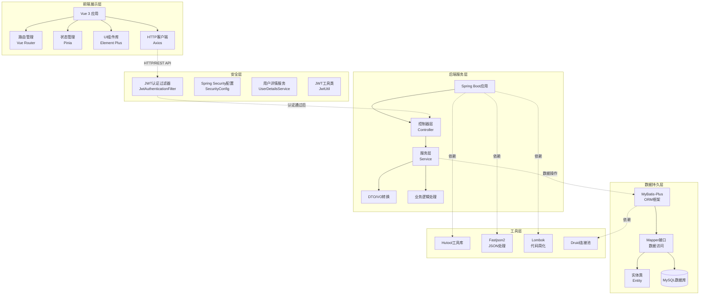
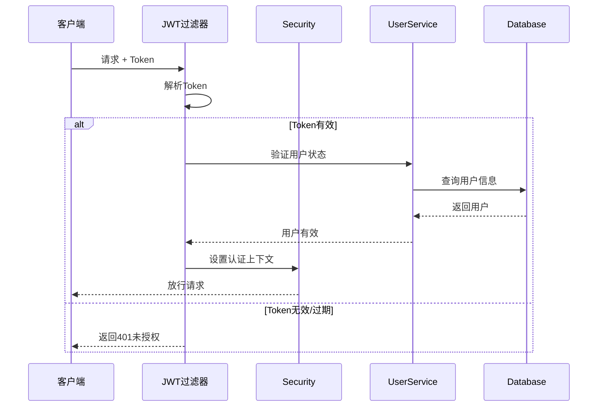
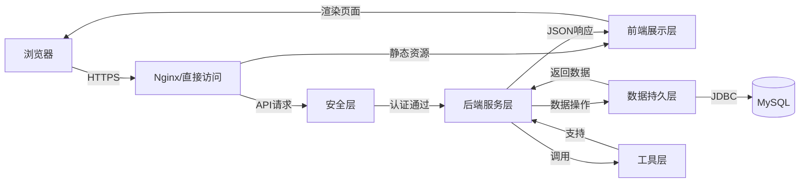
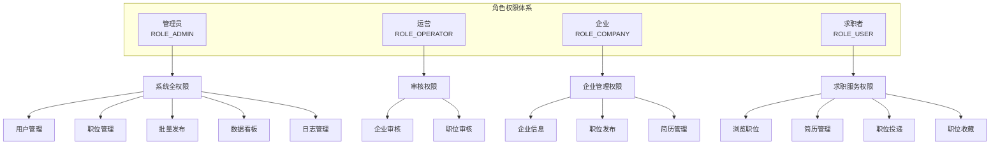

# 基于Java的毕业生招聘信息发布与管理系统

## 项目简介

基于 Vue 3 + Spring Boot + MySQL 的毕业生招聘信息发布与管理系统，支持四角色权限管理：管理员、运营、企业、求职者。

## 技术栈

### 后端技术

| 技术 | 版本 | 说明 |
|------|------|------|
| **Spring Boot** | 3.1.6 | 核心框架，提供自动配置和开箱即用功能 |
| **Spring Security** | 6.1.5 | 安全框架，实现认证和授权 |
| **JWT** | 0.12.3 | JSON Web Token，用于无状态身份认证 |
| **MyBatis-Plus** | 3.5.7 | ORM框架，简化数据库操作 |
| **MySQL** | 8.0.18 | 关系型数据库 |
| **Druid** | 1.2.20 | 数据库连接池，提供监控功能 |
| **Lombok** | 1.18.30 | 代码简化工具，减少样板代码 |
| **Hutool** | 5.8.23 | Java工具类库 |
| **Fastjson2** | 2.0.43 | JSON处理库 |
| **Maven Wrapper** | - | 构建工具，无需本地安装Maven |

### 前端技术

| 技术 | 版本 | 说明 |
|------|------|------|
| **Vue** | 3.3.11 | 渐进式JavaScript框架 |
| **Vite** | 5.0.8 | 前端构建工具，快速冷启动 |
| **Element Plus** | 2.5.1 | UI组件库，提供丰富的组件 |
| **Pinia** | 2.1.7 | 状态管理库，Vuex的替代方案 |
| **Vue Router** | 4.2.5 | 官方路由管理器 |
| **Axios** | 1.6.5 | HTTP客户端，用于API请求 |
| **@element-plus/icons-vue** | 2.3.1 | Element Plus图标库 |

### 开发环境

| 工具 | 版本要求 | 说明 |
|------|----------|------|
| **JDK** | 17+ | Java开发工具包 |
| **Node.js** | 18+ | JavaScript运行环境 |
| **MySQL** | 8.0+ | 数据库服务器 |
| **IDE** | - | IntelliJ IDEA / VS Code |

## 项目结构

```
demo/
├── job-recruitment-backend/     # Spring Boot后端
│   ├── src/main/java/com/recruitment/
│   │   ├── config/              # 配置类
│   │   ├── controller/          # 控制器
│   │   ├── service/             # 服务层
│   │   ├── mapper/              # 数据访问层
│   │   ├── entity/              # 实体类
│   │   ├── dto/                 # 数据传输对象
│   │   ├── security/            # 安全相关
│   │   └── utils/               # 工具类
│   └── src/main/resources/
│       ├── db/schema.sql        # 数据库初始化脚本
│       └── application.yml      # 配置文件
│
└── job-recruitment-frontend/    # Vue3前端
    ├── src/
    │   ├── api/                 # API接口
    │   ├── components/          # 公共组件
    │   ├── views/               # 页面视图
    │   ├── router/              # 路由配置
    │   ├── store/               # 状态管理
    │   └── utils/               # 工具函数
    └── package.json
```

## 系统架构设计

### 架构总览

本系统采用经典的 **前后端分离架构**，基于 **MVC 分层设计模式**，整体架构分为五个核心层次：前端展示层、后端服务层、数据持久层、安全层和工具层。



### 架构分层详解

#### 1. 前端展示层 (Presentation Layer)

**核心技术：** Vue 3 + Vite + Element Plus

| 组件 | 技术 | 职责 |
|------|------|------|
| **路由管理** | Vue Router | 前端路由控制、权限拦截、动态导航 |
| **状态管理** | Pinia | 全局状态管理、用户信息存储、Token管理 |
| **UI组件** | Element Plus | 提供丰富的UI组件库，构建美观界面 |
| **HTTP客户端** | Axios | 封装HTTP请求、拦截器、统一错误处理 |
| **视图组件** | Vue SFC | 页面组件化开发、响应式数据绑定 |

**核心功能：**
- 🎨 四角色界面（管理员/运营/企业/求职者）
- 🔐 前端权限路由拦截
- 📱 响应式布局设计
- 💬 统一API调用封装
- 🎯 组件化开发模式

**目录结构：**
```
frontend/src/
├── views/          # 页面视图（按角色分类）
│   ├── user/       # 求职者页面
│   ├── company/    # 企业页面
│   ├── operator/   # 运营页面
│   └── admin/      # 管理员页面
├── components/     # 公共组件
├── api/           # API接口封装
├── router/        # 路由配置
├── store/         # 状态管理
└── utils/         # 工具函数
```

#### 2. 后端服务层 (Service Layer)

**核心技术：** Spring Boot 3.1.6 + Spring Security

##### 2.1 控制器层 (Controller)

负责接收HTTP请求、参数验证、调用服务层、返回响应。

| 控制器 | 路径 | 职责 |
|--------|------|------|
| AuthController | /api/auth | 用户认证（登录/注册） |
| UserController | /api/user | 用户管理、企业信息、投递管理 |
| JobController | /api/job | 职位管理、搜索、审核 |
| JobFavoriteController | /api/favorite | 职位收藏管理 |
| StatisticsController | /api/statistics | 数据统计 |
| OperationLogController | /api/log | 操作日志查询 |

**设计规范：**
- ✅ 统一返回格式（Result<T>）
- ✅ 参数校验（@Valid）
- ✅ 异常处理（全局异常拦截）
- ✅ 权限控制（@PreAuthorize）

##### 2.2 服务层 (Service)

核心业务逻辑处理，事务管理。

| 服务 | 核心功能 |
|------|----------|
| UserService | 用户认证、用户管理、权限验证 |
| JobService | 职位CRUD、搜索筛选、批量发布、审核 |
| JobFavoriteService | 收藏管理、收藏列表查询 |
| StatisticsService | 数据统计、图表数据聚合 |
| OperationLogService | 日志记录、日志查询 |

**设计特点：**
- 🔄 接口与实现分离
- 💎 事务管理（@Transactional）
- 🎯 业务逻辑封装
- 📊 复杂查询优化

##### 2.3 数据传输对象 (DTO/VO)

| 类型 | 用途 | 示例 |
|------|------|------|
| DTO | 接收前端请求数据 | LoginDTO, RegisterDTO, JobDTO |
| VO | 返回前端展示数据 | PageResult<T>, Result<T> |
| Entity | 数据库表映射 | User, Job, Company |

#### 3. 数据持久层 (Persistence Layer)

**核心技术：** MyBatis-Plus 3.5.7 + MySQL 8.0

##### 3.1 ORM框架 - MyBatis-Plus

**核心特性：**
- 🚀 通用Mapper（BaseMapper）
- 📝 条件构造器（LambdaQueryWrapper）
- 📄 分页插件（PaginationInnerInterceptor）
- 🔍 代码生成器
- ⚡ 性能优化插件

##### 3.2 Mapper层

数据访问接口，继承BaseMapper获得基础CRUD能力。

| Mapper | 功能 | 特殊方法 |
|--------|------|----------|
| UserMapper | 用户数据访问 | - |
| JobMapper | 职位数据访问 | incrementViewCount, selectJobWithCompany |
| CompanyMapper | 企业数据访问 | selectByUserId |
| ResumeMapper | 简历数据访问 | selectDefaultByUserId |
| ApplicationMapper | 投递记录访问 | selectByUserId, selectPageByCompanyId |
| JobFavoriteMapper | 收藏数据访问 | - |
| OperationLogMapper | 日志数据访问 | - |

##### 3.3 数据库设计

**核心表：**
- sys_user（用户表）
- company_info（企业信息表）
- job_info（招聘信息表）
- resume（简历表）
- application（投递记录表）
- job_favorite（收藏岗位表）
- sys_operation_log（操作日志表）

**设计原则：**
- 📌 逻辑删除（deleted字段）
- 🔗 外键约束保证数据完整性
- 📈 索引优化高频查询
- 🔒 唯一约束防止重复操作
- ⏰ 审计字段（create_time, update_time）

#### 4. 安全层 (Security Layer)

**核心技术：** Spring Security 6.1.5 + JWT

##### 4.1 认证流程



##### 4.2 安全组件

| 组件 | 类名 | 职责 |
|------|------|------|
| **JWT认证过滤器** | JwtAuthenticationFilter | 拦截请求、验证Token、设置认证上下文 |
| **安全配置** | SecurityConfig | 配置安全策略、CORS、会话管理、权限规则 |
| **用户详情服务** | UserDetailsServiceImpl | 加载用户信息、认证数据源 |
| **JWT工具类** | JwtUtil | Token生成、解析、验证 |
| **安全工具类** | SecurityUtil | 获取当前用户信息 |

##### 4.3 权限控制

**角色定义：**
- ROLE_ADMIN（管理员）- 最高权限
- ROLE_OPERATOR（运营）- 审核权限
- ROLE_COMPANY（企业）- 企业管理权限
- ROLE_USER（求职者）- 基础用户权限

**权限注解：**
```java
@PreAuthorize("hasRole('管理员')")        // 仅管理员
@PreAuthorize("hasRole('企业')")          // 仅企业
@PreAuthorize("hasRole('求职者')")        // 仅求职者
@PreAuthorize("hasAnyRole('企业', '管理员')") // 多角色
```

**安全策略：**
- 🔐 无状态JWT认证
- 🌐 CORS跨域配置
- 🚫 CSRF禁用（API服务）
- 🔒 密码BCrypt加密
- 📝 操作日志记录
- ⏱️ Token有效期管理

#### 5. 工具层 (Utility Layer)

提供系统级别的工具支持和基础设施。

| 工具 | 技术 | 用途 |
|------|------|------|
| **Hutool** | 5.8.23 | Java工具类库（日期、字符串、加密等） |
| **Fastjson2** | 2.0.43 | 高性能JSON序列化/反序列化 |
| **Lombok** | 1.18.30 | 简化代码（@Data, @Slf4j等注解） |
| **Druid** | 1.2.20 | 数据库连接池、SQL监控 |
| **Maven Wrapper** | - | 项目构建、依赖管理 |

**核心工具类：**
- `JwtUtil` - JWT Token操作
- `SecurityUtil` - 安全上下文访问
- `PageResult` - 分页结果封装
- `Result` - 统一响应格式

### 层次交互关系



**请求处理流程：**

1. **前端发起请求** → Axios封装HTTP请求，携带JWT Token
2. **安全层拦截** → JwtAuthenticationFilter验证Token有效性
3. **控制器接收** → Controller接收请求，参数校验
4. **服务层处理** → Service执行核心业务逻辑，事务管理
5. **持久层操作** → Mapper执行SQL，MyBatis-Plus映射结果
6. **工具层支持** → 各层调用工具类完成特定功能
7. **响应返回** → 统一Result格式，前端接收并渲染

### 架构优势

✅ **前后端分离**：独立开发、独立部署、技术栈灵活  
✅ **分层清晰**：职责明确、易于维护、便于测试  
✅ **安全性高**：JWT无状态认证、角色权限控制、操作日志审计  
✅ **性能优化**：连接池管理、索引优化、分页查询  
✅ **可扩展性**：模块化设计、接口抽象、支持横向扩展  
✅ **开发效率**：MyBatis-Plus简化开发、Lombok减少样板代码  

## 角色权限设计

### 权限总览

系统采用 **RBAC（基于角色的访问控制）** 模型，定义了四种角色，每种角色拥有明确的业务范围和操作权限。



### 角色详细说明

#### 1. 👨‍💼 管理员（ROLE_ADMIN）

**角色编码：** 1  
**业务范围：** 系统全局管理  
**权限级别：** 最高权限

| 功能模块 | 操作权限 | 说明 |
|---------|---------|------|
| **用户管理** | ✅ 查看全部用户<br/>✅ 启用/禁用用户<br/>✅ 删除用户<br/>✅ 修改用户信息 | 管理系统所有用户账号 |
| **职位管理** | ✅ 查看全部职位<br/>✅ 编辑职位<br/>✅ 删除职位<br/>✅ 上下架职位 | 管理所有企业发布的职位 |
| **批量发布** | ✅ 批量导入职位<br/>✅ 批量审核<br/>✅ 批量上下架 | 支持Excel批量操作 |
| **数据看板** | ✅ 查看统计数据<br/>✅ 查看图表分析<br/>✅ 导出数据报表 | 系统运营数据监控 |
| **日志管理** | ✅ 查看操作日志<br/>✅ 筛选日志<br/>✅ 导出日志 | 审计用户操作行为 |
| **企业审核** | ✅ 审核企业信息<br/>✅ 查看审核记录 | 代替运营进行审核 |
| **职位审核** | ✅ 审核职位信息<br/>✅ 查看审核记录 | 代替运营进行审核 |

**前端路由：**
- `/admin/dashboard` - 数据概览
- `/admin/users` - 用户管理
- `/admin/jobs` - 职位管理
- `/admin/batch-publish` - 批量发布
- `/admin/logs` - 日志管理

**后端接口权限：**
```java
@PreAuthorize("hasRole('管理员')")
public Result<Boolean> deleteUser(@PathVariable Long id)
```

---

#### 2. 👨‍💻 运营（ROLE_OPERATOR）

**角色编码：** 2  
**业务范围：** 内容审核与质量控制  
**权限级别：** 中等权限

| 功能模块 | 操作权限 | 说明 |
|---------|---------|------|
| **企业审核** | ✅ 查看待审核企业<br/>✅ 查看资料变更<br/>✅ 通过企业审核<br/>✅ 拒绝企业审核<br/>✅ 填写拒绝原因 | 确保企业信息真实有效，资料变更审核通过后才生效 |
| **职位审核** | ✅ 查看待审核职位<br/>✅ 通过职位审核<br/>✅ 拒绝职位审核<br/>✅ 填写拒绝原因 | 确保职位信息合规 |
| **企业信息查看** | ✅ 查看企业详情<br/>✅ 查看审核历史 | 了解企业信息 |
| **职位信息查看** | ✅ 查看职位详情<br/>✅ 查看审核历史 | 了解职位信息 |

**前端路由：**
- `/operator/companies` - 企业审核
- `/operator/jobs` - 职位审核

**审核流程：**
```
企业首次提交资料 → 待审核状态 → 运营审核 → 通过/拒绝
已通过企业修改资料 → pending_*待审核字段 → 提交审核但岗位不下架 → 运营审核 → 通过后覆盖正式资料/拒绝后保持原资料
企业发布职位 → 待审核状态 → 运营审核 → 通过/拒绝
                                ↓
                          填写拒绝原因（如拒绝）
                                ↓
                          企业修改后重新提交
```

**后端接口权限：**
```java
@PreAuthorize("hasAnyRole('运营', '管理员')")
public Result<Boolean> auditJob(@PathVariable Long id)
```

---

#### 3. 🏢 企业（ROLE_COMPANY）

**角色编码：** 3  
**业务范围：** 企业信息管理与招聘  
**权限级别：** 基础业务权限

| 功能模块 | 操作权限 | 说明 |
|---------|---------|------|
| **企业信息** | ✅ 完善企业信息<br/>✅ 修改企业资料<br/>✅ 上传企业Logo<br/>✅ 保存待审核修改<br/>✅ 提交审核<br/>✅ 查看审核状态 | 需要运营审核通过后才能发布职位；资料变更审核通过后才覆盖正式资料 |
| **职位管理** | ✅ 发布新职位<br/>✅ 编辑职位<br/>✅ 删除职位<br/>✅ 查看职位状态<br/>✅ 查看浏览/投递数 | 职位需要运营审核通过后展示 |
| **简历管理** | ✅ 查看投递记录<br/>✅ 查看求职者简历<br/>✅ 标记感兴趣<br/>✅ 标记不合适<br/>✅ 添加备注 | 管理收到的简历 |
| **职位搜索** | ✅ 浏览职位（自己的）<br/>✅ 筛选职位<br/>✅ 查看统计数据 | 查看自己发布的职位 |

**前端路由：**
- `/company/info` - 企业信息
- `/company/jobs` - 职位管理
- `/company/applications` - 简历管理

**业务流程：**
```
1. 注册企业账号
2. 完善企业信息 → 提交审核
3. 运营审核通过
4. 后续修改企业资料 → 保存待审核修改 → 提交审核但岗位不下架 → 运营通过后更新正式资料
5. 发布职位 → 提交审核
6. 运营审核通过 → 职位展示
7. 接收投递 → 筛选简历
```

**后端接口权限：**
```java
@PreAuthorize("hasRole('企业')")
public Result<Boolean> saveCompanyInfo(@RequestBody Company company)

@PreAuthorize("hasAnyRole('企业', '管理员')")
public Result<Boolean> createJob(@RequestBody Job job)
```

---

#### 4. 👤 求职者（ROLE_USER）

**角色编码：** 4  
**业务范围：** 职位浏览与投递  
**权限级别：** 基础用户权限

| 功能模块 | 操作权限 | 说明 |
|---------|---------|------|
| **职位浏览** | ✅ 查看职位列表<br/>✅ 查看职位详情<br/>✅ 搜索职位<br/>✅ 筛选职位<br/>✅ 查看企业信息 | 无需登录即可浏览 |
| **简历管理** | ✅ 创建简历<br/>✅ 编辑简历<br/>✅ 设置默认简历<br/>✅ 删除简历 | 至少需要一份简历才能投递 |
| **职位投递** | ✅ 投递简历<br/>✅ 查看投递记录<br/>✅ 查看投递状态<br/>✅ 查看企业反馈 | 同一职位只能投递一次 |
| **职位收藏** | ✅ 收藏职位<br/>✅ 取消收藏<br/>✅ 查看收藏列表<br/>✅ 收藏排序 | 方便后续查看 |
| **个人中心** | ✅ 查看个人信息<br/>✅ 修改密码<br/>✅ 更新联系方式 | 管理个人账号 |

**前端路由：**
- `/home` - 首页（公开）
- `/jobs` - 职位列表（公开）
- `/job/:id` - 职位详情（公开）
- `/resume` - 我的简历（需登录）
- `/applications` - 投递记录（需登录）
- `/favorites` - 我的收藏（需登录）

**业务流程：**
```
1. 注册求职者账号（或直接浏览）
2. 完善简历信息
3. 浏览/搜索职位
4. 收藏职位（可选）
5. 投递简历
6. 查看投递状态
7. 接收企业反馈
```

**后端接口权限：**
```java
@PreAuthorize("hasRole('求职者')")
public Result<Boolean> applyJob(@PathVariable Long jobId)

@PreAuthorize("hasRole('求职者')")
public Result<Boolean> addFavorite(@PathVariable Long jobId)
```

---

### 权限矩阵对比

| 功能 | 管理员 | 运营 | 企业 | 求职者 | 公开 |
|------|:------:|:----:|:----:|:------:|:----:|
| **浏览职位** | ✅ | ✅ | ✅ | ✅ | ✅ |
| **搜索职位** | ✅ | ✅ | ✅ | ✅ | ✅ |
| **用户注册** | - | - | - | ✅ | ✅ |
| **用户登录** | ✅ | ✅ | ✅ | ✅ | ✅ |
| **用户管理** | ✅ | ❌ | ❌ | ❌ | ❌ |
| **企业审核** | ✅ | ✅ | ❌ | ❌ | ❌ |
| **职位审核** | ✅ | ✅ | ❌ | ❌ | ❌ |
| **企业信息管理** | ✅ | ❌ | ✅ | ❌ | ❌ |
| **发布职位** | ✅ | ❌ | ✅ | ❌ | ❌ |
| **职位管理** | ✅ | ❌ | ✅ | ❌ | ❌ |
| **批量发布** | ✅ | ❌ | ❌ | ❌ | ❌ |
| **简历管理** | ❌ | ❌ | ❌ | ✅ | ❌ |
| **职位投递** | ❌ | ❌ | ❌ | ✅ | ❌ |
| **职位收藏** | ❌ | ❌ | ❌ | ✅ | ❌ |
| **简历筛选** | ❌ | ❌ | ✅ | ❌ | ❌ |
| **数据统计** | ✅ | ❌ | ❌ | ❌ | ❌ |
| **日志管理** | ✅ | ❌ | ❌ | ❌ | ❌ |

**图例说明：**
- ✅ 有权限
- ❌ 无权限
- - 不适用

---

### 权限控制机制

#### 1. 前端权限控制

**路由守卫：**
```javascript
router.beforeEach(async (to, from, next) => {
  // 检查是否需要管理员权限
  if (to.meta.requireAdmin && !userStore.isAdmin) {
    next('/')
    return
  }
  
  // 检查是否需要运营权限
  if (to.meta.requireOperator && !userStore.isOperator) {
    next('/')
    return
  }
  
  // 检查是否需要企业权限
  if (to.meta.requireCompany && !userStore.isCompany) {
    next('/')
    return
  }
  
  // 检查是否需要求职者权限
  if (to.meta.requireUser && !userStore.isUser) {
    next('/')
    return
  }
  
  next()
})
```

**条件渲染：**
```vue
<template v-if="userStore.isAdmin">
  <el-menu-item index="/admin/users">用户管理</el-menu-item>
</template>

<template v-if="userStore.isCompany">
  <el-menu-item index="/company/jobs">职位管理</el-menu-item>
</template>
```

#### 2. 后端权限控制

**Spring Security 配置：**
```java
.authorizeHttpRequests(auth -> auth
    .requestMatchers("/api/auth/**").permitAll()  // 公开接口
    .requestMatchers("/api/job/list").permitAll() // 公开接口
    .anyRequest().authenticated()                  // 其他需要认证
)
```

**方法级权限控制：**
```java
@PreAuthorize("hasRole('ADMIN')")                    // 单一角色（管理员）
@PreAuthorize("hasAnyRole('COMPANY', 'ADMIN')")      // 多角色（企业或管理员）
@PreAuthorize("hasAuthority('user:delete')")         // 权限表达式
```

**角色映射：**
```java
// 数据库中的角色编码 -> Spring Security角色名
1 (管理员) -> ROLE_ADMIN
2 (运营)   -> ROLE_OPERATOR
3 (企业)   -> ROLE_COMPANY
4 (求职者) -> ROLE_USER
```

#### 3. 数据权限控制

**企业只能访问自己的数据：**
```java
Long userId = SecurityUtil.getCurrentUserId();
Company company = companyMapper.selectByUserId(userId);
```

**求职者只能管理自己的简历：**
```java
List<Resume> resumes = resumeMapper.selectByUserId(userId);
```

**企业只能查看投递到自己公司的简历：**
```java
applicationMapper.selectPageByCompanyId(page, companyId, keyword, category, status);
```

---

### 自动填充机制

**时间字段自动填充：**

系统使用MyBatis-Plus的MetaObjectHandler实现时间字段自动填充：

```java
@Component
public class MyMetaObjectHandler implements MetaObjectHandler {
    @Override
    public void insertFill(MetaObject metaObject) {
        // 插入时自动填充
        this.strictInsertFill(metaObject, "createTime", LocalDateTime.class, LocalDateTime.now());
        this.strictInsertFill(metaObject, "updateTime", LocalDateTime.class, LocalDateTime.now());
        this.strictInsertFill(metaObject, "deleted", Integer.class, 0);
    }

    @Override
    public void updateFill(MetaObject metaObject) {
        // 更新时自动填充
        this.strictUpdateFill(metaObject, "updateTime", LocalDateTime.class, LocalDateTime.now());
    }
}
```

**应用范围：**
- ✅ 所有继承BaseEntity的实体类
- ✅ 无需手动设置createTime和updateTime
- ✅ 保证时间数据的一致性和准确性

---

### 角色转换规则

| 转换场景 | 说明 | 操作者 |
|---------|------|--------|
| **注册选择角色** | 用户注册时可选择求职者或企业 | 用户自己 |
| **角色升级** | 求职者升级为企业（需重新注册） | 管理员 |
| **账号禁用** | 违规账号可被禁用 | 管理员 |
| **账号删除** | 逻辑删除用户账号 | 管理员 |

**注意事项：**
- ⚠️ 一个账号只能对应一个角色
- ⚠️ 角色切换需要重新注册账号
- ⚠️ 企业账号需要审核通过后才能发布职位
- ⚠️ 禁用账号后，该账号无法登录系统

---

### 安全建议

1. **密码安全**
   - 使用BCrypt加密存储
   - 密码长度至少6位
   - 建议定期修改密码

2. **Token管理**
   - JWT Token有效期管理
   - Token过期自动刷新
   - 退出登录清除Token

3. **权限验证**
   - 前端路由拦截
   - 后端接口鉴权
   - 数据权限隔离

4. **操作审计**
   - 记录所有关键操作
   - 记录操作IP和时间
   - 支持操作日志查询
   - 支持多条件筛选（操作人、操作类型、操作模块、操作状态、时间范围）
   - 支持批量操作日志记录

---

### 新增功能特性

1. **批量操作**
   - 批量审核职位（通过/拒绝）
   - 批量导入招聘信息
   
2. **密码管理**
   - 管理员重置用户密码
   - 默认密码规则：用户名+123456
   - BCrypt加密存储
   
3. **日志筛选**
   - 按操作人筛选
   - 按操作类型筛选
   - 按操作模块筛选（下拉选择）
   - 按操作状态筛选
   - 按时间范围筛选（日期范围选择器）
   - 多条件组合查询
   
4. **搜索功能**
   - 职位关键词搜索
   - 搜索历史记录
   - 快速搜索标签
   - 多条件联合筛选

## 功能模块

### 1. 用户认证
- 用户注册（支持求职者和企业角色）
- 用户登录（弹窗模式，无需跳转）
- JWT Token认证
- 权限控制（基于角色的访问控制）

### 2. 管理员功能
- **用户管理**
  - 查看用户列表
  - 启用/禁用用户
  - 删除用户
  - 新增用户（支持所有角色：管理员、运营、企业、求职者）
  - 重置密码（默认密码：用户名+123456）
  
- **职位管理**
  - 查看所有职位
  - 编辑职位信息
  - 删除职位
  
- **批量发布**
  - 批量导入招聘信息
  - Excel模板下载
  
- **操作日志**
  - 查看所有操作日志
  - 按操作人筛选
  - 按操作类型筛选
  - 按操作模块筛选
  - 按操作状态筛选
  - 按时间范围筛选（日期范围选择器）
  - 分页查看
  
- **数据看板**
  - 系统统计数据
  - 数据可视化展示

### 3. 运营功能
- **企业信息审核**
  - 查看待审核企业列表
  - 查看企业待审核资料变更标识
  - 审核通过/拒绝企业
  - 企业资质未审核或未通过时，对应企业岗位保持下架；已通过企业仅修改资料时岗位不下架
  - 查看审核历史
  
- **职位审核**
  - 查看待审核职位列表（分页）
  - 按名称/地点筛选
  - 批量审核通过
  - 批量审核拒绝（填写原因）
  - 单个职位审核
  - 查看职位详情
  
- **职位管理**
  - 查看所有已发布职位
  - 搜索和筛选职位

### 4. 企业功能
- **企业信息管理**
  - 编辑企业信息
  - 上传企业Logo
  - 保存待审核修改
  - 提交资料审核
  - 资料审核期间岗位不自动下架，职位详情继续展示原正式企业资料
  - 查看审核状态
  - 修改联系人信息
  
- **职位管理**
  - 发布新职位
  - 编辑已发布职位
  - 删除职位
  - 查看职位状态（待审核/已发布/已拒绝）
  
- **应聘管理**
  - 查看职位投递列表
  - 查看简历详情
  - 筛选应聘者（感兴趣/不合适）
  - 导出投递数据

### 5. 求职者功能
- **职位浏览**
  - 首页职位推荐
  - 职位列表（分页）
  - 职位详情查看
  
- **职位搜索**
  - 关键词搜索（职位名称、公司名称）
  - 多条件筛选（行业、薪资、地点）
  - 搜索历史记录
  - 快速搜索标签
  
- **简历管理**
  - 创建/编辑简历
  - 管理个人技能
  - 更新教育经历
  - 工作经验管理
  
- **投递管理**
  - 查看投递记录
  - 查看投递状态
  - 查看企业反馈
  
- **职位收藏**
  - 收藏职位
  - 取消收藏
  - 查看收藏列表
  - 从收藏夹直接投递

### 6. 系统功能
- **操作日志审计**
  - 自动记录所有关键操作
  - 记录操作人、操作时间、操作IP
  - 记录请求参数和响应结果
  - 支持多条件组合查询
  - 时间范围筛选
  
- **权限管理**
  - 基于角色的权限控制（RBAC）
  - 四种角色：管理员、运营、企业、求职者
  - 接口级权限保护
  
- **安全特性**
  - 密码BCrypt加密
  - JWT无状态认证
  - CORS跨域支持
  - SQL注入防护
  - XSS攻击防护

## 数据库表结构

### 数据库总览

系统共包含 **11** 张核心数据表，涵盖用户管理、企业信息、职位管理、简历投递、状态历史、面试轮次、Offer、站内通知、操作日志和收藏功能。

### 1. sys_user（用户表）

存储系统所有用户的基础信息，支持四种角色。

| 字段名 | 类型 | 说明 |
|--------|------|------|
| id | BIGINT | 主键ID，自增 |
| username | VARCHAR(50) | 用户名，唯一索引 |
| password | VARCHAR(100) | 密码（BCrypt加密） |
| real_name | VARCHAR(50) | 真实姓名 |
| email | VARCHAR(100) | 邮箱 |
| phone | VARCHAR(20) | 电话 |
| role | TINYINT | 角色：1-管理员 2-运营 3-企业 4-求职者 |
| status | TINYINT | 状态：0-禁用 1-启用 |
| avatar | VARCHAR(200) | 头像URL |
| create_time | DATETIME | 创建时间 |
| update_time | DATETIME | 更新时间 |
| deleted | TINYINT | 逻辑删除：0-未删除 1-已删除 |

**索引：** idx_username, idx_role

### 2. company_info（企业信息表）

存储企业的详细信息，需要运营审核。

| 字段名 | 类型 | 说明 |
|--------|------|------|
| id | BIGINT | 主键ID，自增 |
| user_id | BIGINT | 关联用户ID（外键） |
| company_name | VARCHAR(100) | 企业名称 |
| industry | VARCHAR(50) | 所属行业 |
| scale | VARCHAR(50) | 企业规模 |
| address | VARCHAR(200) | 企业地址 |
| description | TEXT | 企业简介 |
| logo_url | VARCHAR(200) | Logo地址 |
| website | VARCHAR(100) | 企业官网 |
| contact_name | VARCHAR(50) | 联系人 |
| contact_phone | VARCHAR(20) | 联系人电话 |
| contact_email | VARCHAR(100) | 联系人邮箱 |
| status | TINYINT | 审核状态：0-待审核 1-已通过 2-已拒绝 |
| reject_reason | VARCHAR(500) | 拒绝原因 |
| pending_company_name | VARCHAR(100) | 待审核企业名称 |
| pending_industry | VARCHAR(50) | 待审核所属行业 |
| pending_scale | VARCHAR(50) | 待审核企业规模 |
| pending_address | VARCHAR(200) | 待审核企业地址 |
| pending_description | TEXT | 待审核企业简介 |
| pending_logo_url | VARCHAR(200) | 待审核Logo地址 |
| pending_website | VARCHAR(100) | 待审核企业官网 |
| pending_contact_name | VARCHAR(50) | 待审核联系人 |
| pending_contact_phone | VARCHAR(20) | 待审核联系电话 |
| pending_contact_email | VARCHAR(100) | 待审核联系邮箱 |
| create_time | DATETIME | 创建时间 |
| update_time | DATETIME | 更新时间 |
| deleted | TINYINT | 逻辑删除 |

**索引：** idx_user_id, idx_status

企业资料重审规则：已通过企业修改资料时先写入 `pending_*` 字段，点击“提交审核”后岗位不下架，职位详情继续展示原正式企业资料；运营审核通过后 `pending_*` 覆盖正式字段并清空，审核拒绝则保留原正式资料并清空本次待审核修改。只有企业资质本身未审核或未通过时，对应企业岗位才保持下架。

### 3. job_info（招聘信息表）

存储职位招聘信息，包含薪资、要求、状态等信息。

| 字段名 | 类型 | 说明 |
|--------|------|------|
| id | BIGINT | 主键ID，自增 |
| company_id | BIGINT | 企业ID（外键） |
| title | VARCHAR(100) | 职位标题 |
| category | VARCHAR(50) | 职位类别 |
| salary_min | INT | 最低薪资（单位：K，如 16 表示 16K） |
| salary_max | INT | 最高薪资（单位：K，如 26 表示 26K） |
| salary_month | INT | 薪资月数（默认12） |
| work_city | VARCHAR(50) | 工作城市 |
| work_address | VARCHAR(200) | 工作地址 |
| experience | VARCHAR(50) | 经验要求 |
| education | VARCHAR(50) | 学历要求 |
| job_type | TINYINT | 工作类型：1-全职 2-兼职 3-实习 |
| job_desc | TEXT | 职位描述 |
| requirements | TEXT | 岗位要求 |
| welfare | TEXT | 福利待遇 |
| status | TINYINT | 状态：0-待审核 1-已发布 2-已拒绝 3-已下线 |
| reject_reason | VARCHAR(500) | 拒绝原因 |
| view_count | INT | 浏览次数 |
| apply_count | INT | 投递次数 |
| publish_time | DATETIME | 发布时间 |
| deadline | DATE | 截止日期 |
| create_time | DATETIME | 创建时间 |
| update_time | DATETIME | 更新时间 |
| deleted | TINYINT | 逻辑删除 |

**索引：** idx_company_id, idx_status, idx_category, idx_work_city, idx_create_time

### 4. resume（简历表）

存储求职者的简历信息。

| 字段名 | 类型 | 说明 |
|--------|------|------|
| id | BIGINT | 主键ID，自增 |
| user_id | BIGINT | 用户ID（外键） |
| real_name | VARCHAR(50) | 姓名 |
| gender | TINYINT | 性别：0-女 1-男 |
| birth_date | DATE | 出生日期 |
| phone | VARCHAR(20) | 电话 |
| email | VARCHAR(100) | 邮箱 |
| education | VARCHAR(50) | 最高学历 |
| school | VARCHAR(100) | 毕业院校 |
| major | VARCHAR(100) | 专业 |
| graduation_year | INT | 毕业年份 |
| work_experience | TEXT | 工作经历 |
| project_exp | TEXT | 项目经验 |
| self_eval | TEXT | 自我评价 |
| skills | TEXT | 技能特长 |
| expected_city | VARCHAR(50) | 期望城市 |
| expected_salary_min | INT | 期望最低薪资（单位：K） |
| expected_salary_max | INT | 期望最高薪资（单位：K） |
| attachment_url | VARCHAR(200) | 简历附件 |
| is_default | TINYINT | 是否默认简历：0-否 1-是 |
| create_time | DATETIME | 创建时间 |
| update_time | DATETIME | 更新时间 |
| deleted | TINYINT | 逻辑删除 |

**索引：** idx_user_id

### 5. application（投递记录表）

记录求职者的投递行为和企业处理状态。

| 字段名 | 类型 | 说明 |
|--------|------|------|
| id | BIGINT | 主键ID，自增 |
| job_id | BIGINT | 职位ID（外键） |
| resume_id | BIGINT | 简历ID（外键） |
| user_id | BIGINT | 求职者ID（外键） |
| company_id | BIGINT | 企业ID（外键） |
| status | TINYINT | 状态：0-待查看 1-已查看 2-感兴趣 3-不合适 4-面试中 5-面试未通过 6-Offer待确认 7-Offer已接受 8-Offer已拒绝 9-已入职 10-面试通过 11-Offer已过期 |
| remark | VARCHAR(500) | 备注 |
| apply_time | DATETIME | 投递时间 |
| handle_time | DATETIME | 处理时间 |
| create_time | DATETIME | 创建时间 |
| update_time | DATETIME | 更新时间 |
| deleted | TINYINT | 逻辑删除 |

**索引：** idx_job_id, idx_user_id, idx_company_id, idx_status  
**唯一索引：** uk_job_resume (job_id, resume_id) - 防止重复投递

### 6. application_status_history（投递状态历史表）

记录投递状态每一次变化，支撑企业端和求职者端的状态时间线。

| 字段名 | 类型 | 说明 |
|--------|------|------|
| id | BIGINT | 主键ID，自增 |
| application_id | BIGINT | 投递记录ID |
| from_status | TINYINT | 变更前状态 |
| to_status | TINYINT | 变更后状态 |
| action_type | VARCHAR(50) | 动作类型 |
| operator_id | BIGINT | 操作人ID |
| operator_role | TINYINT | 操作人角色 |
| remark | VARCHAR(500) | 说明 |
| create_time | DATETIME | 创建时间 |
| deleted | TINYINT | 逻辑删除 |

### 7. interview_rounds（面试轮次表）

记录企业安排的面试轮次、求职者确认/改期和面试结果。

| 字段名 | 类型 | 说明 |
|--------|------|------|
| id | BIGINT | 主键ID，自增 |
| application_id | BIGINT | 投递记录ID |
| company_id | BIGINT | 企业ID |
| round_no | INT | 面试轮次 |
| interview_type | VARCHAR(50) | 面试方式 |
| scheduled_time | DATETIME | 面试时间 |
| location | VARCHAR(200) | 面试地点或链接 |
| contact_name | VARCHAR(50) | 联系人 |
| confirmation_status | TINYINT | 求职者确认状态 |
| reschedule_reason | VARCHAR(500) | 改期原因 |
| result | TINYINT | 面试结果：0-待定 1-通过 2-未通过 3-取消 |

### 8. offers（Offer表）

记录企业发出的Offer内容、薪资、有效期和求职者响应。

| 字段名 | 类型 | 说明 |
|--------|------|------|
| id | BIGINT | 主键ID，自增 |
| application_id | BIGINT | 投递记录ID |
| company_id | BIGINT | 企业ID |
| title | VARCHAR(100) | Offer标题 |
| salary_min | INT | 最低薪资（单位：K） |
| salary_max | INT | 最高薪资（单位：K） |
| entry_date | DATE | 入职日期 |
| expire_time | DATETIME | 有效期 |
| status | TINYINT | 状态：0-待确认 1-已接受 2-已拒绝 3-已过期 |
| response_time | DATETIME | 响应时间 |

### 9. user_notification（站内通知表，v1.3新增）

记录投递、面试、Offer等业务变化产生的站内通知和未读状态。

| 字段名 | 类型 | 说明 |
|--------|------|------|
| id | BIGINT | 主键ID，自增 |
| user_id | BIGINT | 接收用户ID |
| title | VARCHAR(100) | 通知标题 |
| content | VARCHAR(1000) | 通知内容 |
| type | VARCHAR(50) | 通知类型 |
| business_type | VARCHAR(50) | 关联业务类型 |
| business_id | BIGINT | 关联业务ID |
| is_read | TINYINT | 是否已读：0-未读 1-已读 |
| create_time | DATETIME | 创建时间 |
| update_time | DATETIME | 更新时间 |

### 10. sys_operation_log（操作日志表）

记录用户的操作行为，用于审计和追踪。

| 字段名 | 类型 | 说明 |
|--------|------|------|
| id | BIGINT | 主键ID，自增 |
| user_id | BIGINT | 用户ID |
| username | VARCHAR(50) | 用户名 |
| role_name | VARCHAR(20) | 用户角色 |
| operation_type | VARCHAR(20) | 操作类型：LOGIN/LOGOUT/CREATE/UPDATE/DELETE/QUERY/EXPORT/IMPORT/OTHER |
| operation_module | VARCHAR(50) | 操作模块 |
| operation_desc | VARCHAR(200) | 操作描述 |
| request_method | VARCHAR(10) | 请求方法：GET/POST/PUT/DELETE |
| request_url | VARCHAR(500) | 请求URL |
| request_params | TEXT | 请求参数 |
| response_result | TEXT | 响应结果 |
| status | TINYINT | 操作结果：0-失败 1-成功 |
| error_msg | TEXT | 错误信息 |
| ip_address | VARCHAR(50) | IP地址 |
| ip_location | VARCHAR(100) | IP归属地 |
| user_agent | VARCHAR(500) | 用户代理 |
| execution_time | BIGINT | 执行时长（毫秒） |
| create_time | DATETIME | 创建时间 |
| update_time | DATETIME | 更新时间 |
| deleted | TINYINT | 逻辑删除 |

**索引：** idx_user_id, idx_username, idx_operation_type, idx_operation_module, idx_status, idx_create_time

### 11. job_favorite（收藏岗位表）

记录求职者收藏的职位。

| 字段名 | 类型 | 说明 |
|--------|------|------|
| id | BIGINT | 主键ID，自增 |
| user_id | BIGINT | 用户ID（外键） |
| job_id | BIGINT | 职位ID（外键） |
| create_time | DATETIME | 创建时间 |
| update_time | DATETIME | 更新时间 |
| deleted | TINYINT | 逻辑删除 |

**索引：** idx_user_id, idx_job_id  
**唯一索引：** uk_user_job (user_id, job_id) - 防止重复收藏

### 数据库设计特点

1. **逻辑删除**：所有表都采用 `deleted` 字段实现软删除，保证数据安全
2. **审计字段**：所有表都包含 `create_time`、`update_time` 字段，便于追踪
3. **外键约束**：关键业务表使用外键保证数据完整性
4. **索引优化**：针对高频查询字段建立索引，提升查询性能
5. **唯一约束**：在关键业务场景（投递、收藏）使用唯一约束防止重复操作

## 默认账号

| 角色 | 用户名 | 密码 |
|------|--------|------|
| 管理员 | admin | admin123 |
| 运营 | operator | admin123 |
| 企业-阿里巴巴 | alibaba | admin123 |
| 企业-腾讯 | tencent | admin123 |
| 企业-百度 | baidu | admin123 |
| 求职者-张三 | zhangsan | admin123 |
| 求职者-李四 | lisi | admin123 |
| 求职者-王五 | wangwu | admin123 |
| 求职者-周昊 | zhouhao | admin123 |

## 测试数据脚本说明

- `insert_test_data.sql`：重置型演示数据脚本，会清理并重建演示业务数据，执行前需要确认不再保留当前演示数据。
- `repair_seed_chinese_data.sql`：非破坏性修复脚本，只修复中文文案、薪资K单位、状态历史和站内通知样例，不清理其他已有数据。
- `expand_dashboard_demo_data.sql`：扩展数据脚本，用于补齐首页指标级测试数据，当前验证口径为 580 家企业、1200 个职位、8600 位用户、3200 条投递；管理员不新增，运营共 3 位。脚本会重建其生成的候选人投递及关联面试/Offer/历史/通知，不清理原始测试账号和手工样例。企业 Logo 统一使用 `/uploads/images/company-logos/*.svg` 本地文字图，SVG 内容按企业中文名生成。
- `user_notification` 是 v1.3 新增表，用于站内通知列表、未读数、单条已读和全部已读。
- 薪资字段统一按 K 存储，例如 `salary_min=16` 表示 `16K`，不写入 `16000`。

## 启动方式

### 环境要求
- **Java**: JDK 17+
- **Node.js**: 18+
- **MySQL**: 8.0+

### 后端启动

#### PowerShell 启动（本项目当前使用）

```powershell
cd C:\Users\20927\Desktop\demo\job-recruitment-backend
powershell -ExecutionPolicy Bypass -File .\start.ps1
```

说明：
- `start.ps1` 会设置 `JAVA_HOME=C:\Program Files\Java\jdk-17`
- 启动脚本通过 Maven Wrapper 执行 `spring-boot:run`
- 后端默认端口：`8080`
- API 地址：`http://localhost:8080`

#### IDE 启动

使用 IntelliJ IDEA 或 VS Code 打开 `job-recruitment-backend`，运行 `JobRecruitmentApplication`。

### 前端启动

#### PowerShell / CMD 启动（本项目当前使用）

```powershell
cd C:\Users\20927\Desktop\demo\job-recruitment-frontend
npm install
npm run dev -- --host 127.0.0.1
```

如果依赖已安装，可直接执行：

```powershell
npm run dev
```

说明：
- 前端默认端口：`3000`
- 访问地址：`http://127.0.0.1:3000/` 或 `http://localhost:3000/`
- Vite 已配置 `/api` 代理到 `http://localhost:8080`

## 系统截图

- 登录页面：美观的渐变背景登录界面
- 首页：职位搜索、热门职位展示、数据统计；热门职位按投递数、浏览数、发布时间倒序展示
- 职位列表：多维度筛选、分页展示
- 管理后台：表格展示、操作按钮、弹窗表单

## 特色功能

1. **四角色权限分离**: 管理员、运营、企业、求职者各有独立功能
2. **审核流程**: 企业发布职位需运营审核，确保信息质量
3. **批量发布**: 管理员可批量发布招聘信息
4. **响应式设计**: 基于Element Plus的美观界面
5. **JWT认证**: 无状态的安全认证机制

## 开发说明

本项目是一个完整的毕业生招聘信息发布与管理系统演示项目，包含：
- 完整的后端API接口
- 美观的前端界面
- 完善的权限控制
- 数据库设计


