# 毕业生招聘信息发布与管理系统 - 业务流程图

> 📅 创建时间：2026-04-27  
> 🔄 最后更新：2026-05-24  
> 📊 文档版本：v1.3  
> 🎯 文档目的：详细描述系统各功能模块的业务流程

---

## 目录

- [系统功能需求分析](#系统功能需求分析)
  - [功能模块总览](#功能模块总览)
  - [角色功能矩阵](#角色功能矩阵)
  - [模块流程统计](#模块流程统计)
  - [API接口统计](#api接口统计)
  - [数据库表关系](#数据库表关系)
- [1. 用户认证流程](#1-用户认证流程)
- [2. 企业审核流程](#2-企业审核流程)
- [3. 职位发布与审核流程](#3-职位发布与审核流程)
- [4. 职位投递流程](#4-职位投递流程)
- [5. 简历管理流程](#5-简历管理流程)
- [6. 收藏职位流程](#6-收藏职位流程)
- [7. 用户管理流程](#7-用户管理流程)
- [8. 操作日志记录流程](#8-操作日志记录流程)
- [9. 文件上传流程](#9-文件上传流程)
- [10. 数据统计流程](#10-数据统计流程)
- [11. 批量发布流程](#11-批量发布流程)
- [12. 权限验证流程](#12-权限验证流程)
- [13. 站内通知流程](#13-站内通知流程)

---

## 系统功能需求分析

### 功能模块总览

系统采用前后端分离架构，基于RBAC（基于角色的访问控制）模型，实现四角色权限管理。整体功能划分为 **13个核心模块**，涵盖用户认证、企业管理、职位管理、简历投递、面试/Offer、站内通知、收藏管理、数据统计等功能。

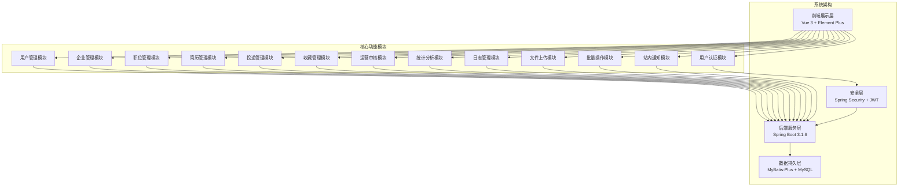
```mermaid
graph TB
    subgraph 系统架构
        A[前端展示层<br/>Vue 3 + Element Plus]
        B[后端服务层<br/>Spring Boot 3.1.6]
        C[数据持久层<br/>MyBatis-Plus + MySQL]
        D[安全层<br/>Spring Security + JWT]
    end
    
    subgraph 核心功能模块
        M1[用户认证模块]
        M2[用户管理模块]
        M3[企业管理模块]
        M4[职位管理模块]
        M5[简历管理模块]
        M6[投递管理模块]
        M7[收藏管理模块]
        M8[运营审核模块]
        M9[统计分析模块]
        M10[日志管理模块]
        M11[文件上传模块]
        M12[批量操作模块]
        M13[站内通知模块]
    end
    
    A --> M1
    A --> M2
    A --> M3
    A --> M4
    A --> M5
    A --> M6
    A --> M7
    A --> M8
    A --> M9
    A --> M10
    A --> M11
    A --> M12
    A --> M13
    
    M1 --> D
    M2 --> B
    M3 --> B
    M4 --> B
    M5 --> B
    M6 --> B
    M7 --> B
    M8 --> B
    M9 --> B
    M10 --> B
    M11 --> B
    M12 --> B
    M13 --> B
    
    B --> C
    D --> B
```

### 角色功能矩阵

系统支持四种角色，每种角色拥有不同的功能权限：

| 功能模块 | 管理员<br/>(ADMIN) | 运营<br/>(OPERATOR) | 企业<br/>(COMPANY) | 求职者<br/>(USER) | 公开 |
|---------|:---:|:---:|:---:|:---:|:---:|
| **用户认证** | ✅ | ✅ | ✅ | ✅ | ✅ |
| **用户管理** | ✅ 全部权限 | ❌ | ❌ | ❌ | ❌ |
| **企业信息** | ✅ 查看 | ✅ 审核 | ✅ 管理 | ❌ | ❌ |
| **职位管理** | ✅ 全部权限 | ✅ 审核 | ✅ 发布/管理 | ❌ | ✅ 浏览 |
| **简历管理** | ✅ 查看 | ❌ | ❌ | ✅ 管理 | ❌ |
| **投递管理** | ✅ 查看 | ❌ | ✅ 处理投递 | ✅ 投递 | ❌ |
| **站内通知** | ✅ 查看 | ✅ 查看 | ✅ 查看/接收 | ✅ 查看/接收 | ❌ |
| **收藏管理** | ❌ | ❌ | ❌ | ✅ 收藏 | ❌ |
| **运营审核** | ✅ 代替审核 | ✅ 审核 | ❌ | ❌ | ❌ |
| **统计分析** | ✅ 全局统计 | ❌ | ✅ 企业统计 | ❌ | ❌ |
| **日志管理** | ✅ 查看/清理 | ❌ | ❌ | ❌ | ❌ |
| **文件上传** | ✅ | ✅ | ✅ | ✅ | ❌ |
| **批量发布** | ✅ | ❌ | ❌ | ❌ | ❌ |

**图例说明：**
- ✅ 表示该角色拥有此功能的完整权限
- ❌ 表示该角色无此功能权限
- ✅ 查看/审核 表示特定权限范围

### 模块流程统计

#### 1. 用户认证模块

| 统计项 | 数量/状态 |
|--------|----------|
| **功能点** | 2个（登录、注册） |
| **API接口** | 2个 |
| **业务流程** | 2个 |
| **涉及数据表** | sys_user |
| **关键技术** | JWT、BCrypt加密、参数校验 |
| **平均流程步骤** | 6-8步 |
| **异常处理** | 用户禁用、密码错误、用户名重复 |

**流程清单：**
- ✅ 用户登录流程（6步）
- ✅ 用户注册流程（8步）

#### 2. 用户管理模块

| 统计项 | 数量/状态 |
|--------|----------|
| **功能点** | 6个（列表、创建、删除、启用/禁用、重置密码、查看详情） |
| **API接口** | 6个 |
| **业务流程** | 2个 |
| **涉及数据表** | sys_user |
| **权限要求** | ADMIN |
| **平均流程步骤** | 5-7步 |
| **异常处理** | 用户不存在、权限不足、用户名重复 |

**流程清单：**
- ✅ 管理员管理用户流程（7步）
- ✅ 创建用户流程（6步）

#### 3. 企业管理模块

| 统计项 | 数量/状态 |
|--------|----------|
| **功能点** | 5个（信息填写、保存待审核修改、提交审核、查看状态、修改信息） |
| **API接口** | 3个 |
| **业务流程** | 1个 |
| **涉及数据表** | company_info、sys_user |
| **权限要求** | COMPANY |
| **平均流程步骤** | 10-12步 |
| **异常处理** | 企业未通过审核、信息不完整、重复提交、资料审核期间岗位下架 |

**流程清单：**
- ✅ 企业信息提交、重审与审核流程（12步）
- ✅ 企业审核状态流转（3种状态）

#### 4. 职位管理模块

| 统计项 | 数量/状态 |
|--------|----------|
| **功能点** | 7个（发布、编辑、删除、列表、详情、搜索、筛选） |
| **API接口** | 8个 |
| **业务流程** | 2个 |
| **涉及数据表** | job_info、company_info |
| **权限要求** | COMPANY发布，OPERATOR审核，公开浏览 |
| **平均流程步骤** | 8-12步 |
| **异常处理** | 企业未审核、职位不存在、权限不足 |

**流程清单：**
- ✅ 职位发布流程（12步）
- ✅ 职位状态流转（4种状态）

#### 5. 简历管理模块

| 统计项 | 数量/状态 |
|--------|----------|
| **功能点** | 5个（创建、编辑、删除、设置默认、查看） |
| **API接口** | 4个 |
| **业务流程** | 2个 |
| **涉及数据表** | resume、sys_user |
| **权限要求** | USER |
| **平均流程步骤** | 7-9步 |
| **异常处理** | 简历不存在、文件上传失败、权限不足 |

**流程清单：**
- ✅ 简历创建与更新流程（9步）
- ✅ 设置默认简历流程（5步）

#### 6. 投递管理模块

| 统计项 | 数量/状态 |
|--------|----------|
| **功能点** | 13个（投递、查看列表、查看简历、初筛状态、面试安排、面试确认、改期申请、面试结果、Offer发送、Offer响应、入职确认、状态轨迹、状态通知） |
| **API接口** | 24个左右（投递、投递列表、企业处理、面试、确认/改期、Offer、入职、状态历史、通知等） |
| **业务流程** | 4个 |
| **涉及数据表** | application、application_status_history、job_info、resume、company_info、interview_rounds、offers、user_notification |
| **权限要求** | USER投递，COMPANY处理 |
| **平均流程步骤** | 10-14步 |
| **异常处理** | 重复投递、职位已下线、简历不存在 |

**流程清单：**
- ✅ 求职者投递职位流程（14步）
- ✅ 面试安排与结果反馈流程
- ✅ 求职者面试确认与改期流程
- ✅ Offer发送、响应与入职确认流程
- ✅ 状态变更历史记录流程
- ✅ 状态变更站内通知流程
- ✅ 投递状态流转（12种状态）

#### 7. 收藏管理模块

| 统计项 | 数量/状态 |
|--------|----------|
| **功能点** | 4个（收藏、取消收藏、收藏列表、检查状态） |
| **API接口** | 4个 |
| **业务流程** | 1个 |
| **涉及数据表** | job_favorite、job_info |
| **权限要求** | USER |
| **平均流程步骤** | 5-7步 |
| **异常处理** | 重复收藏、职位不存在 |

**流程清单：**
- ✅ 收藏职位流程（7步）
- ✅ 收藏状态流转（2种状态）

#### 8. 运营审核模块

| 统计项 | 数量/状态 |
|--------|----------|
| **功能点** | 6个（企业审核列表、企业通过、企业拒绝、职位审核列表、职位通过、职位拒绝） |
| **API接口** | 6个 |
| **业务流程** | 2个（企业审核、职位审核） |
| **涉及数据表** | company_info、job_info、sys_operation_log |
| **权限要求** | OPERATOR、ADMIN |
| **平均流程步骤** | 6-8步 |
| **异常处理** | 审核状态异常、拒绝原因为空 |

**流程清单：**
- ✅ 企业审核流程（已包含在企业管理模块）
- ✅ 职位审核流程（已包含在职位管理模块）

#### 9. 统计分析模块

| 统计项 | 数量/状态 |
|--------|----------|
| **功能点** | 2个（管理员统计、企业统计） |
| **API接口** | 2个 |
| **业务流程** | 2个 |
| **涉及数据表** | sys_user、company_info、job_info、application |
| **权限要求** | ADMIN、COMPANY |
| **平均流程步骤** | 6-8步 |
| **异常处理** | 数据为空、权限不足 |

**流程清单：**
- ✅ 管理员统计数据流程（8步）
- ✅ 企业统计数据流程（6步）

#### 10. 日志管理模块

| 统计项 | 数量/状态 |
|--------|----------|
| **功能点** | 3个（日志列表、多条件筛选、清空日志） |
| **API接口** | 2个 |
| **业务流程** | 2个 |
| **涉及数据表** | sys_operation_log |
| **权限要求** | ADMIN |
| **平均流程步骤** | 5-8步 |
| **异常处理** | 日志为空、筛选条件无效 |

**流程清单：**
- ✅ AOP自动记录日志流程（8步）
- ✅ 日志查询流程（6步）

#### 11. 文件上传模块

| 统计项 | 数量/状态 |
|--------|----------|
| **功能点** | 3个（图片上传、PDF上传、文件删除） |
| **API接口** | 3个 |
| **业务流程** | 1个 |
| **涉及数据表** | 无（文件系统存储） |
| **权限要求** | 已登录用户 |
| **平均流程步骤** | 6-8步 |
| **异常处理** | 文件格式错误、文件大小超限、存储失败 |

**流程清单：**
- ✅ 图片/PDF上传流程（8步）

#### 12. 批量操作模块

| 统计项 | 数量/状态 |
|--------|----------|
| **功能点** | 2个（批量导入职位、批量审核） |
| **API接口** | 1个 |
| **业务流程** | 1个 |
| **涉及数据表** | job_info、company_info |
| **权限要求** | ADMIN |
| **平均流程步骤** | 8-10步 |
| **异常处理** | Excel格式错误、数据验证失败、部分导入失败 |

**流程清单：**
- ✅ 批量导入职位流程（10步）

#### 13. 站内通知模块

| 统计项 | 数量/状态 |
|--------|----------|
| **功能点** | 4个（通知列表、未读数量、单条已读、全部已读） |
| **API接口** | 4个 |
| **业务流程** | 1个 |
| **涉及数据表** | user_notification、application、interview_rounds、offers |
| **权限要求** | 已登录用户 |
| **平均流程步骤** | 4-6步 |
| **异常处理** | 通知不存在、非本人通知、重复已读 |

**流程清单：**
- ✅ 站内通知读取与已读流程（6步）

### API接口统计

#### 接口总数统计

| 模块 | GET | POST | PUT | DELETE | 总计 |
|------|:---:|:----:|:---:|:------:|:----:|
| 用户认证 | 0 | 2 | 0 | 0 | 2 |
| 用户管理 | 2 | 1 | 3 | 1 | 7 |
| 企业管理 | 1 | 2 | 1 | 0 | 4 |
| 职位管理 | 3 | 2 | 2 | 1 | 8 |
| 简历管理 | 1 | 1 | 2 | 0 | 4 |
| 投递管理 | 8 | 8 | 8 | 0 | 24 |
| 收藏管理 | 2 | 1 | 0 | 1 | 4 |
| 运营审核 | 2 | 0 | 4 | 0 | 6 |
| 统计分析 | 2 | 0 | 0 | 0 | 2 |
| 日志管理 | 1 | 0 | 0 | 1 | 2 |
| 文件上传 | 0 | 2 | 0 | 1 | 3 |
| 批量操作 | 0 | 1 | 0 | 0 | 1 |
| 站内通知 | 2 | 0 | 2 | 0 | 4 |
| **总计** | **24** | **20** | **22** | **5** | **71** |

#### 接口权限分布

| 权限级别 | 接口数量 | 占比 |
|----------|---------|------|
| 公开访问 | 6 | 约8% |
| 已登录用户 | 15 | 约21% |
| 求职者(USER) | 14 | 约20% |
| 企业(COMPANY) | 24 | 约34% |
| 运营(OPERATOR) | 6 | 约8% |
| 管理员(ADMIN) | 6 | 约8% |

### 数据库表关系

#### 核心数据表

| 表名 | 记录数(测试) | 字段数 | 外键数 | 索引数 | 主要用途 |
|------|-------------|--------|--------|--------|----------|
| sys_user | 10 | 12 | 0 | 2 | 用户信息存储 |
| company_info | 580 | 25 | 1 | 2 | 企业正式资料、待审核资料与审核状态 |
| job_info | 1200 | 21 | 1 | 5 | 职位信息存储 |
| resume | 8016 | 20 | 1 | 1 | 简历信息存储 |
| application | 3200 | 11+ | 4 | 4 | 投递记录存储 |
| application_status_history | 3207 | 10+ | 2 | 3 | 投递状态历史 |
| interview_rounds | 1069 | 20+ | 2 | 3 | 面试轮次与确认/改期 |
| offers | 1333 | 20+ | 2 | 3 | Offer内容与响应 |
| user_notification | 2139 | 10+ | 1 | 3 | 站内通知与未读状态 |
| job_favorite | 2 | 6 | 2 | 2 | 收藏记录存储 |
| sys_operation_log | 动态增长 | 17+ | 0 | 5 | 操作日志存储 |

#### 表关系图

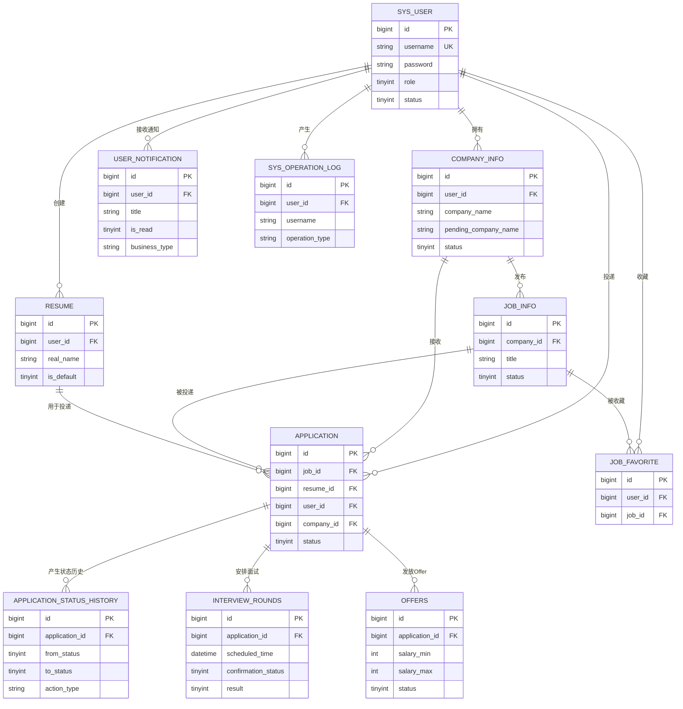
```mermaid
erDiagram
    SYS_USER ||--o{ COMPANY_INFO : "拥有"
    SYS_USER ||--o{ RESUME : "创建"
    SYS_USER ||--o{ APPLICATION : "投递"
    SYS_USER ||--o{ JOB_FAVORITE : "收藏"
    SYS_USER ||--o{ USER_NOTIFICATION : "接收通知"
    SYS_USER ||--o{ SYS_OPERATION_LOG : "产生"
    
    COMPANY_INFO ||--o{ JOB_INFO : "发布"
    COMPANY_INFO ||--o{ APPLICATION : "接收"
    
    JOB_INFO ||--o{ APPLICATION : "被投递"
    JOB_INFO ||--o{ JOB_FAVORITE : "被收藏"
    
    RESUME ||--o{ APPLICATION : "用于投递"

    APPLICATION ||--o{ APPLICATION_STATUS_HISTORY : "产生状态历史"
    APPLICATION ||--o{ INTERVIEW_ROUNDS : "安排面试"
    APPLICATION ||--o{ OFFERS : "发放Offer"
    
    SYS_USER {
        bigint id PK
        string username UK
        string password
        tinyint role
        tinyint status
    }
    
    COMPANY_INFO {
        bigint id PK
        bigint user_id FK
        string company_name
        string pending_company_name
        tinyint status
    }
    
    JOB_INFO {
        bigint id PK
        bigint company_id FK
        string title
        tinyint status
    }
    
    RESUME {
        bigint id PK
        bigint user_id FK
        string real_name
        tinyint is_default
    }
    
    APPLICATION {
        bigint id PK
        bigint job_id FK
        bigint resume_id FK
        bigint user_id FK
        bigint company_id FK
        tinyint status
    }
    
    JOB_FAVORITE {
        bigint id PK
        bigint user_id FK
        bigint job_id FK
    }

    APPLICATION_STATUS_HISTORY {
        bigint id PK
        bigint application_id FK
        tinyint from_status
        tinyint to_status
        string action_type
    }

    INTERVIEW_ROUNDS {
        bigint id PK
        bigint application_id FK
        datetime scheduled_time
        tinyint confirmation_status
        tinyint result
    }

    OFFERS {
        bigint id PK
        bigint application_id FK
        int salary_min
        int salary_max
        tinyint status
    }

    USER_NOTIFICATION {
        bigint id PK
        bigint user_id FK
        string title
        tinyint is_read
        string business_type
    }
    
    SYS_OPERATION_LOG {
        bigint id PK
        bigint user_id FK
        string username
        string operation_type
    }
```

#### 数据流转关系

**核心业务流程数据流转：**

1. **用户注册登录**
   ```
   用户输入 → sys_user表验证 → 生成JWT → 返回Token
   ```

2. **企业审核流程**
   ```
   首次提交 → company_info表(状态=0) → 运营审核 → company_info表(状态=1/2)
   已通过企业修改 → pending_*字段暂存 → 提交审核并下架岗位 → 运营审核通过后覆盖正式资料
   ```

3. **职位发布流程**
   ```
   企业发布 → job_info表(状态=0) → 运营审核 → job_info表(状态=1) → 求职者可见
   ```

4. **职位投递流程**
   ```
   求职者投递 → application表(状态=0) → 企业查看简历(状态=1) → 初筛(状态=2/3)
   → 安排面试 → 求职者确认/申请改期 → 记录结果(状态=4/5/10)
   → 发送/响应Offer(状态=6/7/8/11) → 确认入职(状态=9)
   → application_status_history表记录每次状态变更
   → user_notification表记录站内通知
   ```

5. **测试数据口径**
   ```
   insert_test_data.sql → 重置型演示数据脚本，会清理并重建演示业务数据
   repair_seed_chinese_data.sql → 非破坏性修复脚本，修复中文文案、薪资K单位、状态历史、通知样例
   expand_dashboard_demo_data.sql → 扩展到580家企业、1200个职位、8600个用户、3200条投递
   add_company_pending_review_fields.sql → 增加企业资料重审pending_*字段
   adjust_company_audit_demo_data.sql → 生成4家待审核、4家未通过企业，并下架对应岗位
   ```

6. **收藏职位流程**
   ```
   求职者收藏 → job_favorite表 → 收藏列表展示
   ```

7. **薪资字段口径**
   ```
   salary_min/salary_max统一按K存储，例如16表示16K，不写入16000
   ```

---

## 1. 用户认证流程

### 1.1 用户登录流程

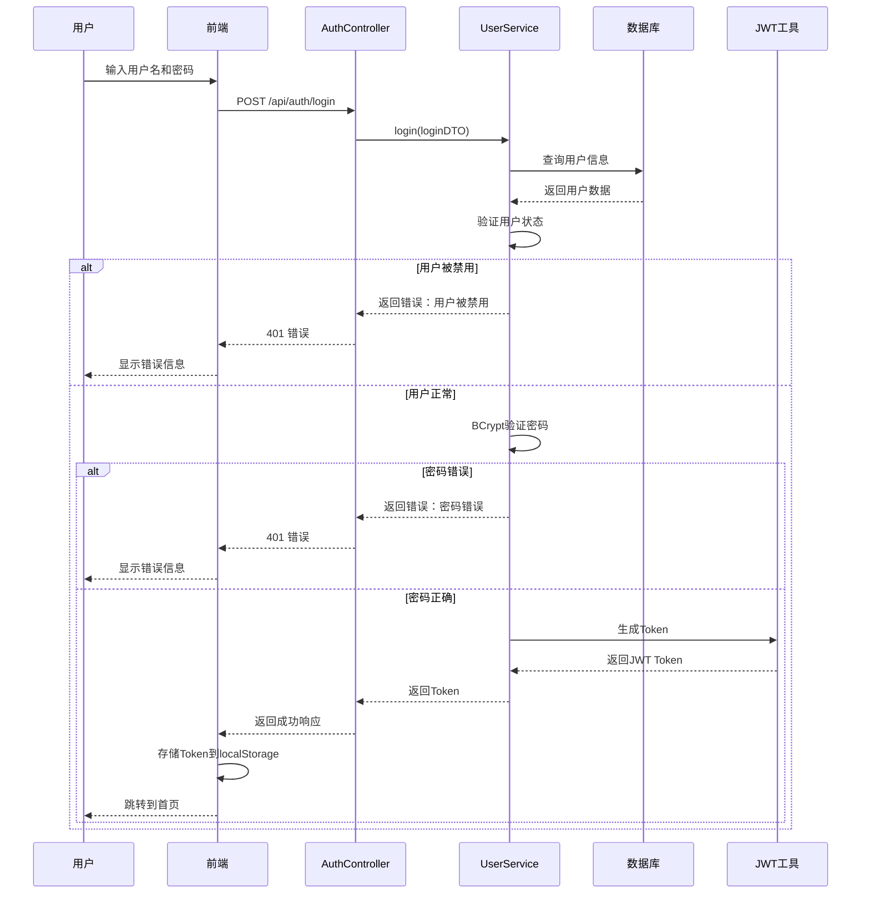
```mermaid
sequenceDiagram
    participant U as 用户
    participant F as 前端
    participant C as AuthController
    participant S as UserService
    participant DB as 数据库
    participant JWT as JWT工具

    U->>F: 输入用户名和密码
    F->>C: POST /api/auth/login
    C->>S: login(loginDTO)
    S->>DB: 查询用户信息
    DB-->>S: 返回用户数据
    S->>S: 验证用户状态
    alt 用户被禁用
        S-->>C: 返回错误：用户被禁用
        C-->>F: 401 错误
        F-->>U: 显示错误信息
    else 用户正常
        S->>S: BCrypt验证密码
        alt 密码错误
            S-->>C: 返回错误：密码错误
            C-->>F: 401 错误
            F-->>U: 显示错误信息
        else 密码正确
            S->>JWT: 生成Token
            JWT-->>S: 返回JWT Token
            S-->>C: 返回Token
            C-->>F: 返回成功响应
            F->>F: 存储Token到localStorage
            F-->>U: 跳转到首页
        end
    end
```

**流程说明：**
1. 用户在前端输入用户名和密码
2. 前端调用登录API接口
3. 后端查询数据库验证用户是否存在
4. 检查用户状态（启用/禁用）
5. 使用BCrypt算法验证密码
6. 验证通过后生成JWT Token
7. 返回Token给前端，前端存储并跳转

### 1.2 用户注册流程

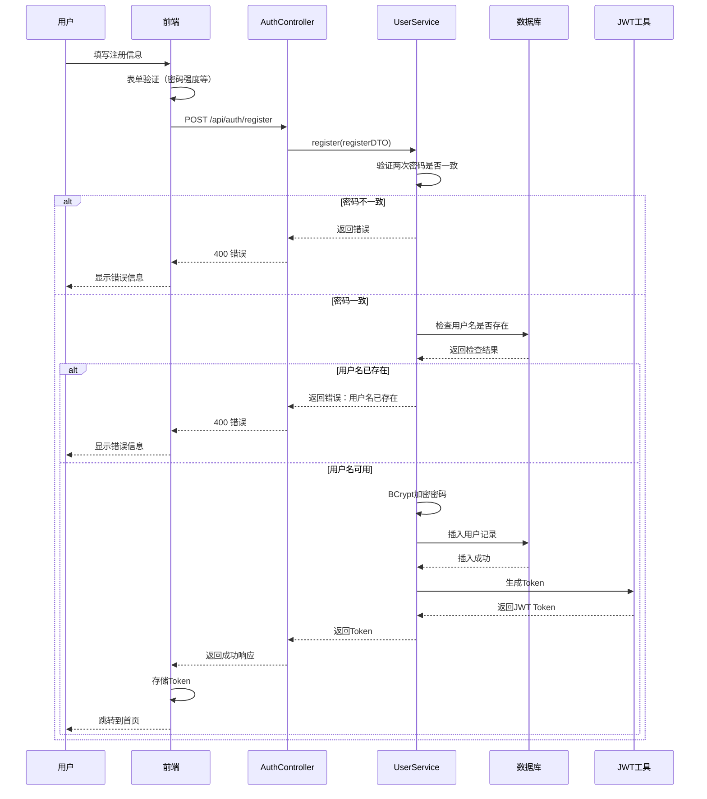
```mermaid
sequenceDiagram
    participant U as 用户
    participant F as 前端
    participant C as AuthController
    participant S as UserService
    participant DB as 数据库
    participant JWT as JWT工具

    U->>F: 填写注册信息
    F->>F: 表单验证（密码强度等）
    F->>C: POST /api/auth/register
    C->>S: register(registerDTO)
    S->>S: 验证两次密码是否一致
    alt 密码不一致
        S-->>C: 返回错误
        C-->>F: 400 错误
        F-->>U: 显示错误信息
    else 密码一致
        S->>DB: 检查用户名是否存在
        DB-->>S: 返回检查结果
        alt 用户名已存在
            S-->>C: 返回错误：用户名已存在
            C-->>F: 400 错误
            F-->>U: 显示错误信息
        else 用户名可用
            S->>S: BCrypt加密密码
            S->>DB: 插入用户记录
            DB-->>S: 插入成功
            S->>JWT: 生成Token
            JWT-->>S: 返回JWT Token
            S-->>C: 返回Token
            C-->>F: 返回成功响应
            F->>F: 存储Token
            F-->>U: 跳转到首页
        end
    end
```

**流程说明：**
1. 用户填写注册表单（用户名、密码、确认密码、角色等）
2. 前端进行表单验证（密码强度、邮箱格式等）
3. 后端验证两次密码是否一致
4. 检查用户名是否已存在
5. 使用BCrypt加密密码
6. 插入用户记录到数据库
7. 生成JWT Token并返回
8. 前端存储Token并跳转

---

## 2. 企业审核流程

### 2.1 企业信息提交与审核流程

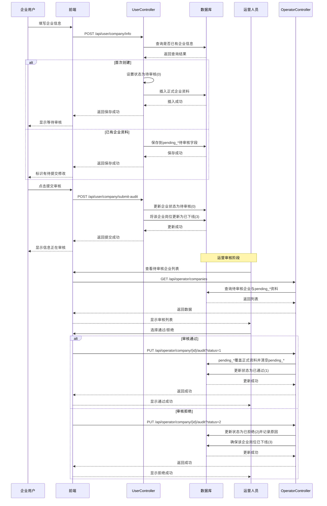
```mermaid
sequenceDiagram
    participant E as 企业用户
    participant F as 前端
    participant C as UserController
    participant DB as 数据库
    participant O as 运营人员
    participant OC as OperatorController

    E->>F: 填写企业信息
    F->>C: POST /api/user/company/info
    C->>DB: 查询是否已有企业信息
    DB-->>C: 返回查询结果
    alt 首次创建
        C->>C: 设置状态为待审核(0)
        C->>DB: 插入正式企业资料
        DB-->>C: 插入成功
        C-->>F: 返回保存成功
        F-->>E: 显示等待审核
    else 已有企业资料
        C->>DB: 保存到pending_*待审核字段
        DB-->>C: 保存成功
        C-->>F: 返回保存成功
        F-->>E: 标识有待提交修改
    end

    E->>F: 点击提交审核
    F->>C: POST /api/user/company/submit-audit
    C->>DB: 更新企业状态为待审核(0)
    C->>DB: 将该企业岗位更新为已下线(3)
    DB-->>C: 更新成功
    C-->>F: 返回提交成功
    F-->>E: 显示信息正在审核

    Note over O,DB: 运营审核阶段
    O->>F: 查看待审核企业列表
    F->>OC: GET /api/operator/companies
    OC->>DB: 查询待审核企业与pending_*资料
    DB-->>OC: 返回列表
    OC-->>F: 返回数据
    F-->>O: 显示审核列表

    O->>F: 选择通过/拒绝
    alt 审核通过
        F->>OC: PUT /api/operator/company/{id}/audit?status=1
        OC->>DB: pending_*覆盖正式资料并清空pending_*
        OC->>DB: 更新状态为已通过(1)
        DB-->>OC: 更新成功
        OC-->>F: 返回成功
        F-->>O: 显示通过成功
    else 审核拒绝
        F->>OC: PUT /api/operator/company/{id}/audit?status=2
        OC->>DB: 更新状态为已拒绝(2)并记录原因
        OC->>DB: 确保该企业岗位已下线(3)
        DB-->>OC: 更新成功
        OC-->>F: 返回成功
        F-->>O: 显示拒绝成功
    end
```

**流程说明：**
1. 企业用户首次填写企业信息时，系统保存正式企业资料并设置为“待审核”。
2. 已通过企业再次修改资料时，修改内容先写入 `pending_*` 待审核字段，正式资料暂不覆盖。
3. 企业点击“提交审核”后，企业状态变为“待审核”，该企业下所有岗位自动下架。
4. 运营人员查看待审核企业列表，若存在资料变更，页面会标识“资料变更”。
5. 审核通过：`pending_*` 覆盖正式资料并清空，企业恢复已通过状态。
6. 审核拒绝：记录拒绝原因，企业资料不覆盖，岗位保持下架，企业需要修改后重新提交。

### 2.2 企业审核状态流转

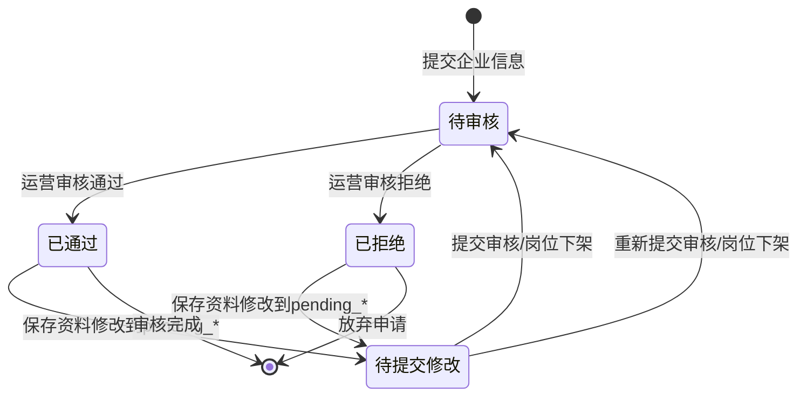
```mermaid
stateDiagram-v2
    [*] --> 待审核: 提交企业信息
    待审核 --> 已通过: 运营审核通过
    待审核 --> 已拒绝: 运营审核拒绝
    已通过 --> 待提交修改: 保存资料修改到pending_*
    待提交修改 --> 待审核: 提交审核/岗位下架
    已拒绝 --> 待提交修改: 保存资料修改到pending_*
    待提交修改 --> 待审核: 重新提交审核/岗位下架
    已拒绝 --> [*]: 放弃申请
    已通过 --> [*]: 审核完成
```

**状态说明：**
- **待审核 (0)**：企业刚提交信息或修改后重新提交
- **已通过 (1)**：运营审核通过，企业可以发布职位
- **已拒绝 (2)**：运营审核拒绝，需要填写拒绝原因
- **待提交修改**：页面状态，表示企业已保存待审核修改但尚未提交审核；数据存储在 `pending_*` 字段。

---

## 3. 职位发布与审核流程

### 3.1 职位发布流程

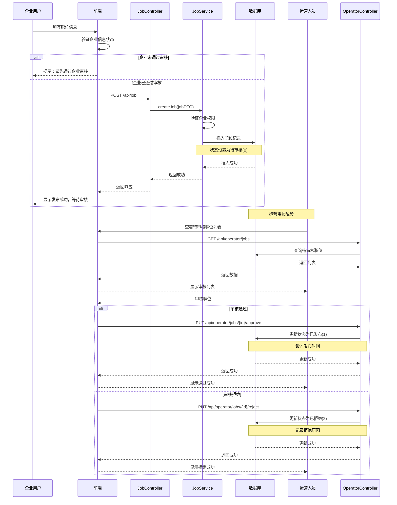
```mermaid
sequenceDiagram
    participant E as 企业用户
    participant F as 前端
    participant C as JobController
    participant S as JobService
    participant DB as 数据库
    participant O as 运营人员
    participant OC as OperatorController

    E->>F: 填写职位信息
    F->>F: 验证企业信息状态
    alt 企业未通过审核
        F-->>E: 提示：请先通过企业审核
    else 企业已通过审核
        F->>C: POST /api/job
        C->>S: createJob(jobDTO)
        S->>S: 验证企业权限
        S->>DB: 插入职位记录
        Note over S,DB: 状态设置为待审核(0)
        DB-->>S: 插入成功
        S-->>C: 返回成功
        C-->>F: 返回响应
        F-->>E: 显示发布成功，等待审核
    end

    Note over O,DB: 运营审核阶段
    O->>F: 查看待审核职位列表
    F->>OC: GET /api/operator/jobs
    OC->>DB: 查询待审核职位
    DB-->>OC: 返回列表
    OC-->>F: 返回数据
    F-->>O: 显示审核列表

    O->>F: 审核职位
    alt 审核通过
        F->>OC: PUT /api/operator/jobs/{id}/approve
        OC->>DB: 更新状态为已发布(1)
        Note over OC,DB: 设置发布时间
        DB-->>OC: 更新成功
        OC-->>F: 返回成功
        F-->>O: 显示通过成功
    else 审核拒绝
        F->>OC: PUT /api/operator/jobs/{id}/reject
        OC->>DB: 更新状态为已拒绝(2)
        Note over OC,DB: 记录拒绝原因
        DB-->>OC: 更新成功
        OC-->>F: 返回成功
        F-->>O: 显示拒绝成功
    end
```

**流程说明：**
1. 企业用户填写职位信息
2. 系统验证企业是否通过审核
3. 创建职位记录，状态设为"待审核"
4. 运营人员查看待审核职位列表
5. 运营人员进行审核（通过/拒绝）
6. 审核通过：职位上线，求职者可见
7. 审核拒绝：记录拒绝原因，企业可修改后重新提交

### 3.2 职位状态流转

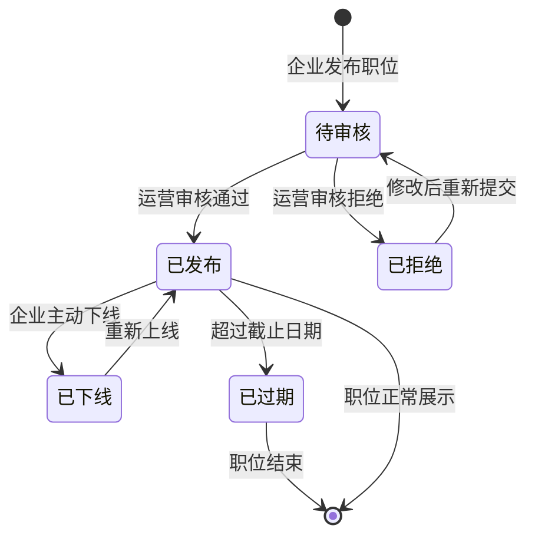
```mermaid
stateDiagram-v2
    [*] --> 待审核: 企业发布职位
    待审核 --> 已发布: 运营审核通过
    待审核 --> 已拒绝: 运营审核拒绝
    已拒绝 --> 待审核: 修改后重新提交
    已发布 --> 已下线: 企业主动下线
    已发布 --> 已过期: 超过截止日期
    已下线 --> 已发布: 重新上线
    已过期 --> [*]: 职位结束
    已发布 --> [*]: 职位正常展示
```

**状态说明：**
- **待审核 (0)**：职位刚发布或修改后重新提交
- **已发布 (1)**：运营审核通过，求职者可见
- **已拒绝 (2)**：运营审核拒绝，需要修改
- **已下线 (3)**：企业主动下线或管理员操作

---

## 4. 职位投递流程

### 4.1 求职者投递职位流程

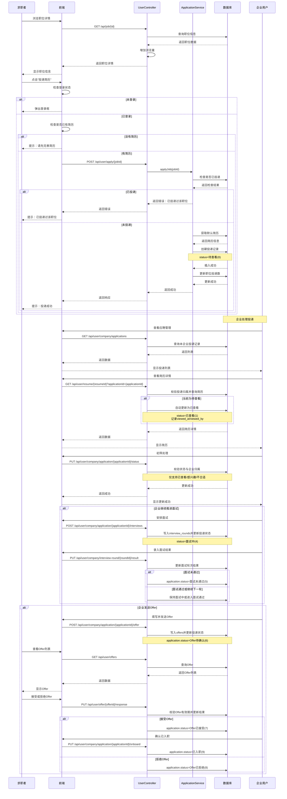
```mermaid
sequenceDiagram
    participant U as 求职者
    participant F as 前端
    participant C as UserController
    participant S as ApplicationService
    participant DB as 数据库
    participant E as 企业用户

    U->>F: 浏览职位详情
    F->>C: GET /api/job/{id}
    C->>DB: 查询职位信息
    DB-->>C: 返回职位数据
    C->>C: 增加浏览量
    C-->>F: 返回职位详情
    F-->>U: 显示职位信息

    U->>F: 点击"投递简历"
    F->>F: 检查登录状态
    alt 未登录
        F-->>U: 弹出登录框
    else 已登录
        F->>F: 检查是否已有简历
        alt 没有简历
            F-->>U: 提示：请先完善简历
        else 有简历
            F->>C: POST /api/user/apply/{jobId}
            C->>S: applyJob(jobId)
            S->>DB: 检查是否已投递
            DB-->>S: 返回检查结果
            alt 已投递
                S-->>C: 返回错误：已投递过该职位
                C-->>F: 返回错误
                F-->>U: 提示：已投递过该职位
            else 未投递
                S->>DB: 获取默认简历
                DB-->>S: 返回简历信息
                S->>DB: 创建投递记录
                Note over S,DB: status=待查看(0)
                DB-->>S: 插入成功
                S->>DB: 更新职位投递数
                DB-->>S: 更新成功
                S-->>C: 返回成功
                C-->>F: 返回响应
                F-->>U: 提示：投递成功
            end
        end
    end

    Note over E,DB: 企业处理投递
    E->>F: 查看应聘管理
    F->>C: GET /api/user/company/applications
    C->>DB: 查询本企业投递记录
    DB-->>C: 返回列表
    C-->>F: 返回数据
    F-->>E: 显示投递列表

    E->>F: 查看简历详情
    F->>C: GET /api/user/resume/{resumeId}?applicationId={applicationId}
    C->>DB: 校验投递归属并查询简历
    alt 当前为待查看
        C->>DB: 自动更新为已查看
        Note over C,DB: status=已查看(1)<br/>记录viewed_at/viewed_by
    end
    DB-->>C: 返回简历详情
    C-->>F: 返回数据
    F-->>E: 显示简历

    E->>F: 初筛处理
    F->>C: PUT /api/user/company/application/{applicationId}/status
    C->>DB: 校验状态与企业归属
    Note over C,DB: 仅支持已查看/感兴趣/不合适
    DB-->>C: 更新成功
    C-->>F: 返回成功
    F-->>E: 显示更新成功

    alt 企业继续推进面试
        E->>F: 安排面试
        F->>C: POST /api/user/company/application/{applicationId}/interviews
        C->>DB: 写入interview_rounds并更新投递状态
        Note over C,DB: status=面试中(4)

        E->>F: 录入面试结果
        F->>C: PUT /api/user/company/interview-round/{roundId}/result
        C->>DB: 更新面试轮次结果
        alt 面试未通过
            C->>DB: application.status=面试未通过(5)
        else 面试通过或继续下一轮
            C->>DB: 保持面试中或进入面试通过
        end
    end

    alt 企业发送Offer
        E->>F: 填写并发送Offer
        F->>C: POST /api/user/company/application/{applicationId}/offer
        C->>DB: 写入offers并更新投递状态
        Note over C,DB: application.status=Offer待确认(6)

        U->>F: 查看Offer列表
        F->>C: GET /api/user/offers
        C->>DB: 查询Offer
        DB-->>C: 返回Offer列表
        C-->>F: 返回数据
        F-->>U: 显示Offer

        U->>F: 接受或拒绝Offer
        F->>C: PUT /api/user/offer/{offerId}/response
        C->>DB: 校验Offer有效期并更新结果
        alt 接受Offer
            C->>DB: application.status=Offer已接受(7)
            E->>F: 确认已入职
            F->>C: PUT /api/user/company/application/{applicationId}/onboard
            C->>DB: application.status=已入职(9)
        else 拒绝Offer
            C->>DB: application.status=Offer已拒绝(8)
        end
    end
```

**流程说明：**
1. 求职者浏览职位详情，系统自动增加浏览量
2. 求职者点击投递简历
3. 系统检查登录状态和简历完整性
4. 检查是否已投递该职位（防止重复投递）
5. 创建投递记录，状态为"待查看"
6. 更新职位的投递数量
7. 企业查看投递列表
8. 企业查看简历时，待查看投递自动流转为"已查看"
9. 企业可做初筛处理：已查看、感兴趣或不合适
10. 对感兴趣候选人安排面试，并记录每轮面试结果
11. 面试通过后企业发送Offer，求职者接受或拒绝
12. Offer被接受后，企业确认入职，投递进入最终闭环

### 4.2 投递状态流转

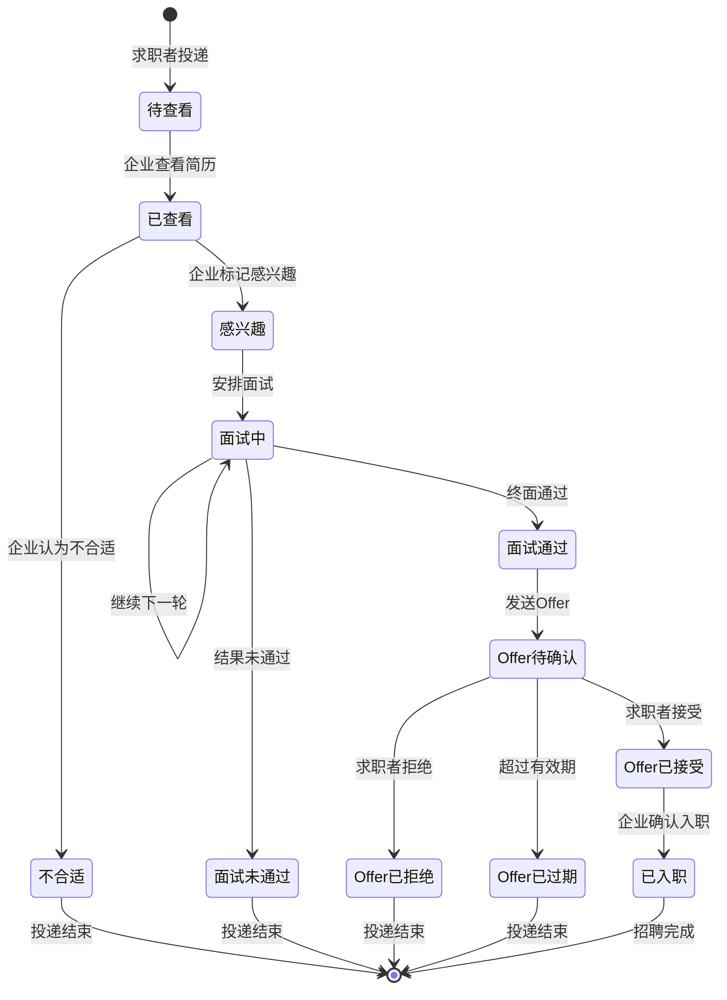
```mermaid
stateDiagram-v2
    [*] --> 待查看: 求职者投递
    待查看 --> 已查看: 企业查看简历
    已查看 --> 感兴趣: 企业标记感兴趣
    已查看 --> 不合适: 企业认为不合适
    感兴趣 --> 面试中: 安排面试
    面试中 --> 面试中: 继续下一轮
    面试中 --> 面试未通过: 结果未通过
    面试中 --> 面试通过: 终面通过
    面试通过 --> Offer待确认: 发送Offer
    Offer待确认 --> Offer已接受: 求职者接受
    Offer待确认 --> Offer已拒绝: 求职者拒绝
    Offer待确认 --> Offer已过期: 超过有效期
    Offer已接受 --> 已入职: 企业确认入职
    不合适 --> [*]: 投递结束
    面试未通过 --> [*]: 投递结束
    Offer已拒绝 --> [*]: 投递结束
    Offer已过期 --> [*]: 投递结束
    已入职 --> [*]: 招聘完成
```

**状态说明：**
- **待查看 (0)**：求职者刚投递，企业未查看
- **已查看 (1)**：企业已查看简历
- **感兴趣 (2)**：企业对求职者感兴趣，可安排面试
- **不合适 (3)**：企业认为求职者不符合要求
- **面试中 (4)**：企业已安排面试或面试流程未结束
- **面试未通过 (5)**：面试结果未通过，投递结束
- **Offer待确认 (6)**：企业已发送Offer，等待求职者响应
- **Offer已接受 (7)**：求职者接受Offer，等待企业确认入职
- **Offer已拒绝 (8)**：求职者拒绝Offer，投递结束
- **已入职 (9)**：企业确认候选人已入职，招聘完成
- **面试通过 (10)**：终面通过，等待企业发送Offer
- **Offer已过期 (11)**：Offer超过有效期，投递结束

---

## 5. 简历管理流程

### 5.1 简历创建与更新流程

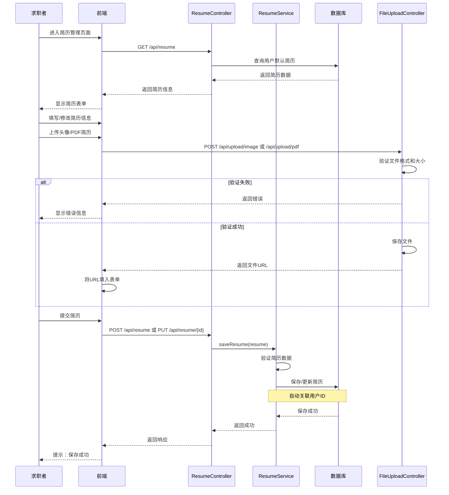
```mermaid
sequenceDiagram
    participant U as 求职者
    participant F as 前端
    participant C as ResumeController
    participant S as ResumeService
    participant DB as 数据库
    participant FU as FileUploadController

    U->>F: 进入简历管理页面
    F->>C: GET /api/resume
    C->>DB: 查询用户默认简历
    DB-->>C: 返回简历数据
    C-->>F: 返回简历信息
    F-->>U: 显示简历表单

    U->>F: 填写/修改简历信息
    U->>F: 上传头像/PDF简历
    F->>FU: POST /api/upload/image 或 /api/upload/pdf
    FU->>FU: 验证文件格式和大小
    alt 验证失败
        FU-->>F: 返回错误
        F-->>U: 显示错误信息
    else 验证成功
        FU->>FU: 保存文件
        FU-->>F: 返回文件URL
        F->>F: 将URL填入表单
    end

    U->>F: 提交简历
    F->>C: POST /api/resume 或 PUT /api/resume/{id}
    C->>S: saveResume(resume)
    S->>S: 验证简历数据
    S->>DB: 保存/更新简历
    Note over S,DB: 自动关联用户ID
    DB-->>S: 保存成功
    S-->>C: 返回成功
    C-->>F: 返回响应
    F-->>U: 提示：保存成功
```

**流程说明：**
1. 求职者进入简历管理页面
2. 系统查询用户的默认简历
3. 求职者填写或修改简历信息
4. 可上传头像和PDF简历附件
5. 文件上传成功后返回URL
6. 提交简历数据
7. 系统自动关联当前用户ID
8. 保存或更新简历记录

### 5.2 设置默认简历流程

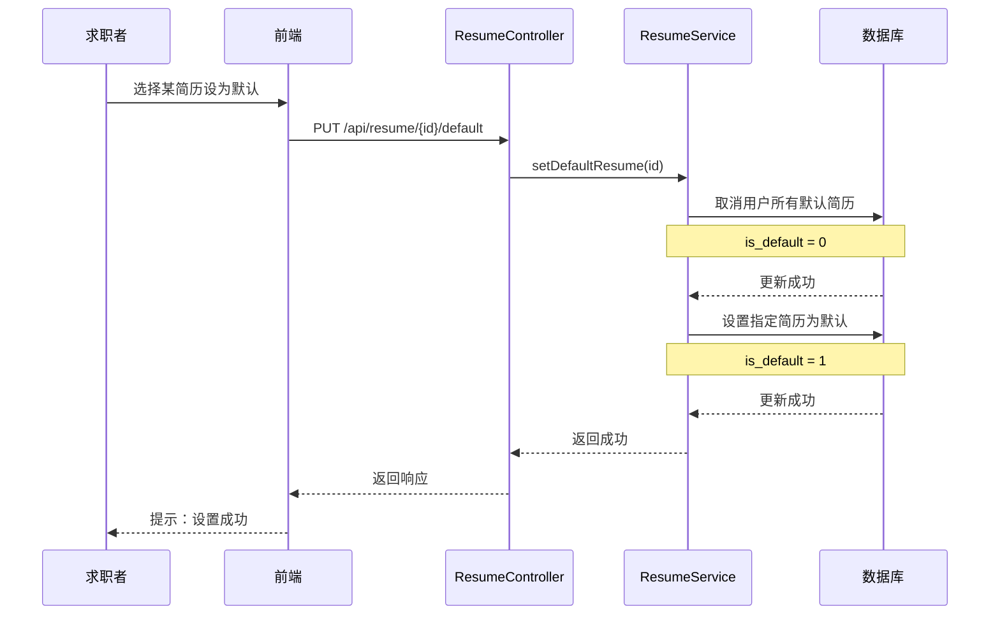
```mermaid
sequenceDiagram
    participant U as 求职者
    participant F as 前端
    participant C as ResumeController
    participant S as ResumeService
    participant DB as 数据库

    U->>F: 选择某简历设为默认
    F->>C: PUT /api/resume/{id}/default
    C->>S: setDefaultResume(id)
    S->>DB: 取消用户所有默认简历
    Note over S,DB: is_default = 0
    DB-->>S: 更新成功
    S->>DB: 设置指定简历为默认
    Note over S,DB: is_default = 1
    DB-->>S: 更新成功
    S-->>C: 返回成功
    C-->>F: 返回响应
    F-->>U: 提示：设置成功
```

**流程说明：**
1. 求职者选择某份简历设为默认
2. 系统先取消该用户所有简历的默认状态
3. 再设置指定简历为默认简历
4. 保证每个用户只有一份默认简历

---

## 6. 收藏职位流程

### 6.1 收藏职位流程

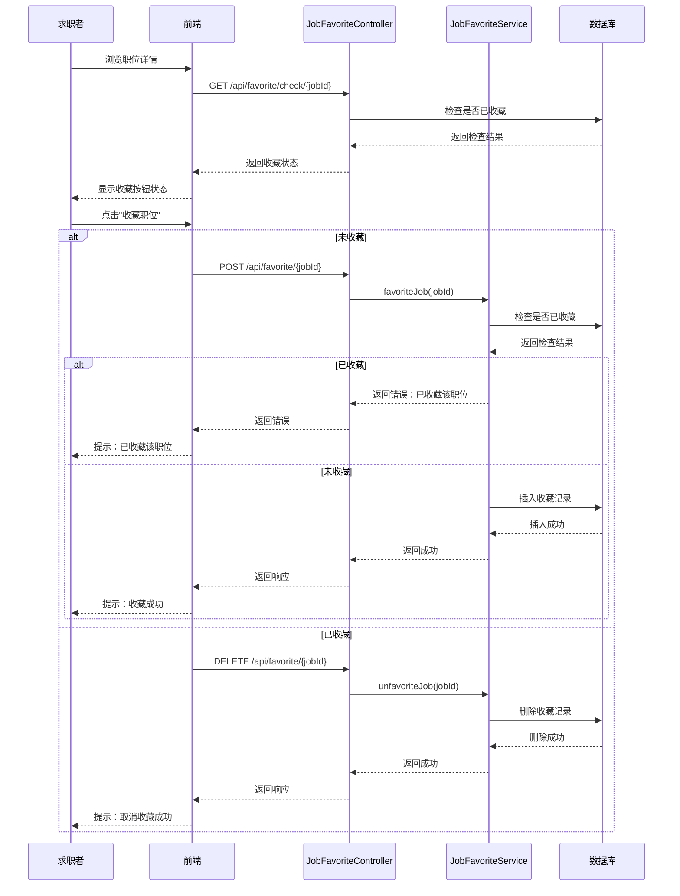
```mermaid
sequenceDiagram
    participant U as 求职者
    participant F as 前端
    participant C as JobFavoriteController
    participant S as JobFavoriteService
    participant DB as 数据库

    U->>F: 浏览职位详情
    F->>C: GET /api/favorite/check/{jobId}
    C->>DB: 检查是否已收藏
    DB-->>C: 返回检查结果
    C-->>F: 返回收藏状态
    F-->>U: 显示收藏按钮状态

    U->>F: 点击"收藏职位"
    alt 未收藏
        F->>C: POST /api/favorite/{jobId}
        C->>S: favoriteJob(jobId)
        S->>DB: 检查是否已收藏
        DB-->>S: 返回检查结果
        alt 已收藏
            S-->>C: 返回错误：已收藏该职位
            C-->>F: 返回错误
            F-->>U: 提示：已收藏该职位
        else 未收藏
            S->>DB: 插入收藏记录
            DB-->>S: 插入成功
            S-->>C: 返回成功
            C-->>F: 返回响应
            F-->>U: 提示：收藏成功
        end
    else 已收藏
        F->>C: DELETE /api/favorite/{jobId}
        C->>S: unfavoriteJob(jobId)
        S->>DB: 删除收藏记录
        DB-->>S: 删除成功
        S-->>C: 返回成功
        C-->>F: 返回响应
        F-->>U: 提示：取消收藏成功
    end
```

**流程说明：**
1. 求职者浏览职位时，系统检查收藏状态
2. 点击收藏职位按钮
3. 如果未收藏，则创建收藏记录
4. 如果已收藏，则取消收藏
5. 使用唯一约束防止重复收藏

### 6.2 收藏状态流转

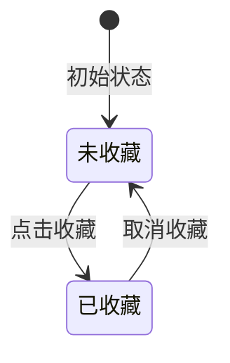
```mermaid
stateDiagram-v2
    [*] --> 未收藏: 初始状态
    未收藏 --> 已收藏: 点击收藏
    已收藏 --> 未收藏: 取消收藏
```

---

## 7. 用户管理流程

### 7.1 管理员管理用户流程

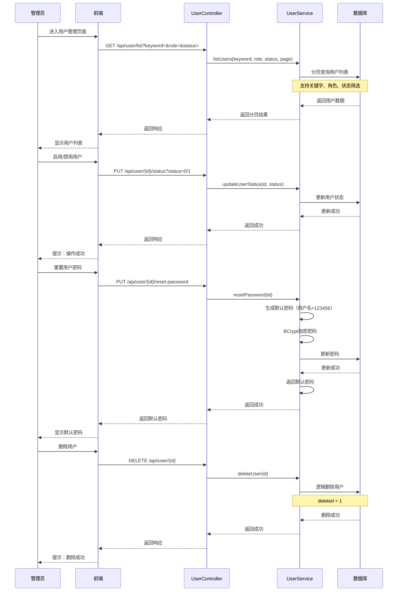
```mermaid
sequenceDiagram
    participant A as 管理员
    participant F as 前端
    participant C as UserController
    participant S as UserService
    participant DB as 数据库

    A->>F: 进入用户管理页面
    F->>C: GET /api/user/list?keyword=&role=&status=
    C->>S: listUsers(keyword, role, status, page)
    S->>DB: 分页查询用户列表
    Note over S,DB: 支持关键字、角色、状态筛选
    DB-->>S: 返回用户数据
    S-->>C: 返回分页结果
    C-->>F: 返回响应
    F-->>A: 显示用户列表

    A->>F: 启用/禁用用户
    F->>C: PUT /api/user/{id}/status?status=0/1
    C->>S: updateUserStatus(id, status)
    S->>DB: 更新用户状态
    DB-->>S: 更新成功
    S-->>C: 返回成功
    C-->>F: 返回响应
    F-->>A: 提示：操作成功

    A->>F: 重置用户密码
    F->>C: PUT /api/user/{id}/reset-password
    C->>S: resetPassword(id)
    S->>S: 生成默认密码（用户名+123456）
    S->>S: BCrypt加密密码
    S->>DB: 更新密码
    DB-->>S: 更新成功
    S->>S: 返回默认密码
    S-->>C: 返回成功
    C-->>F: 返回默认密码
    F-->>A: 显示默认密码

    A->>F: 删除用户
    F->>C: DELETE /api/user/{id}
    C->>S: deleteUser(id)
    S->>DB: 逻辑删除用户
    Note over S,DB: deleted = 1
    DB-->>S: 删除成功
    S-->>C: 返回成功
    C-->>F: 返回响应
    F-->>A: 提示：删除成功
```

**流程说明：**
1. 管理员查看用户列表，支持多条件筛选
2. 可以启用或禁用用户
3. 可以重置用户密码为默认密码
4. 删除用户采用逻辑删除方式

### 7.2 创建用户流程

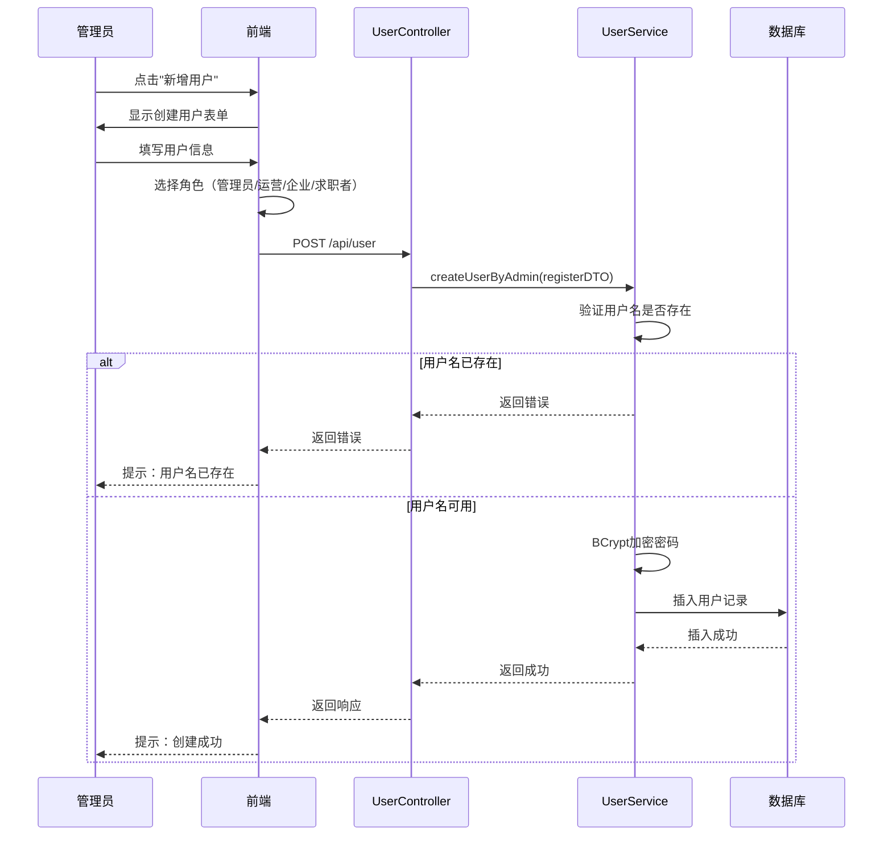
```mermaid
sequenceDiagram
    participant A as 管理员
    participant F as 前端
    participant C as UserController
    participant S as UserService
    participant DB as 数据库

    A->>F: 点击"新增用户"
    F->>A: 显示创建用户表单
    A->>F: 填写用户信息
    F->>F: 选择角色（管理员/运营/企业/求职者）
    F->>C: POST /api/user
    C->>S: createUserByAdmin(registerDTO)
    S->>S: 验证用户名是否存在
    alt 用户名已存在
        S-->>C: 返回错误
        C-->>F: 返回错误
        F-->>A: 提示：用户名已存在
    else 用户名可用
        S->>S: BCrypt加密密码
        S->>DB: 插入用户记录
        DB-->>S: 插入成功
        S-->>C: 返回成功
        C-->>F: 返回响应
        F-->>A: 提示：创建成功
    end
```

---

## 8. 操作日志记录流程

### 8.1 AOP自动记录日志流程

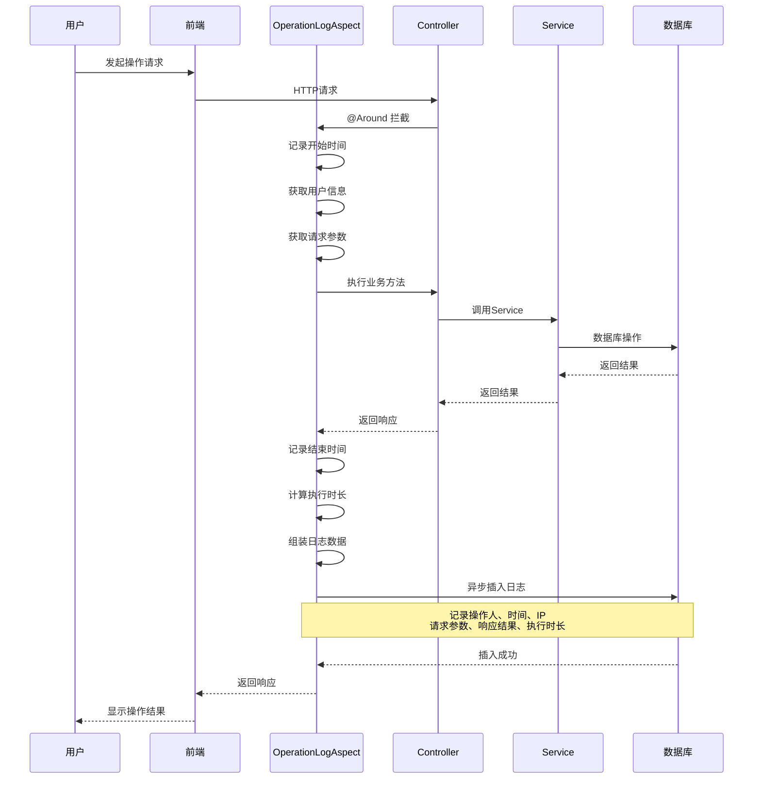
```mermaid
sequenceDiagram
    participant U as 用户
    participant F as 前端
    participant AOP as OperationLogAspect
    participant C as Controller
    participant S as Service
    participant DB as 数据库

    U->>F: 发起操作请求
    F->>C: HTTP请求
    C->>AOP: @Around 拦截
    AOP->>AOP: 记录开始时间
    AOP->>AOP: 获取用户信息
    AOP->>AOP: 获取请求参数
    AOP->>C: 执行业务方法
    C->>S: 调用Service
    S->>DB: 数据库操作
    DB-->>S: 返回结果
    S-->>C: 返回结果
    C-->>AOP: 返回响应
    AOP->>AOP: 记录结束时间
    AOP->>AOP: 计算执行时长
    AOP->>AOP: 组装日志数据
    AOP->>DB: 异步插入日志
    Note over AOP,DB: 记录操作人、时间、IP<br/>请求参数、响应结果、执行时长
    DB-->>AOP: 插入成功
    AOP-->>F: 返回响应
    F-->>U: 显示操作结果
```

**流程说明：**
1. 用户发起操作请求
2. AOP切面拦截Controller方法
3. 记录操作开始时间
4. 获取当前用户信息、请求参数
5. 执行业务逻辑
6. 记录操作结束时间，计算执行时长
7. 组装日志数据（操作人、操作类型、操作模块、请求URL、参数、响应结果、IP等）
8. 异步插入日志记录

### 8.2 日志查询流程

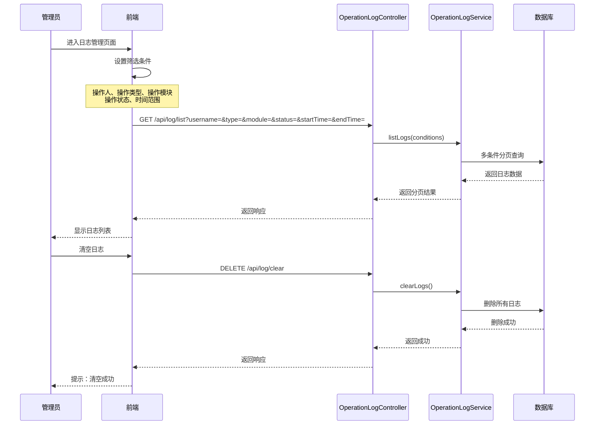
```mermaid
sequenceDiagram
    participant A as 管理员
    participant F as 前端
    participant C as OperationLogController
    participant S as OperationLogService
    participant DB as 数据库

    A->>F: 进入日志管理页面
    F->>F: 设置筛选条件
    Note over F: 操作人、操作类型、操作模块<br/>操作状态、时间范围
    F->>C: GET /api/log/list?username=&type=&module=&status=&startTime=&endTime=
    C->>S: listLogs(conditions)
    S->>DB: 多条件分页查询
    DB-->>S: 返回日志数据
    S-->>C: 返回分页结果
    C-->>F: 返回响应
    F-->>A: 显示日志列表

    A->>F: 清空日志
    F->>C: DELETE /api/log/clear
    C->>S: clearLogs()
    S->>DB: 删除所有日志
    DB-->>S: 删除成功
    S-->>C: 返回成功
    C-->>F: 返回响应
    F-->>A: 提示：清空成功
```

---

## 9. 文件上传流程

### 9.1 图片/PDF上传流程

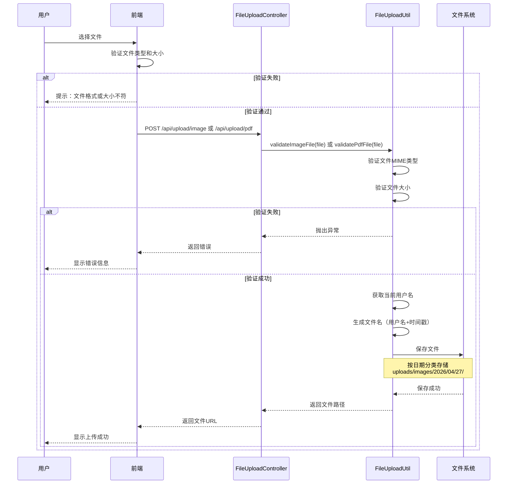
```mermaid
sequenceDiagram
    participant U as 用户
    participant F as 前端
    participant C as FileUploadController
    participant FU as FileUploadUtil
    participant FS as 文件系统

    U->>F: 选择文件
    F->>F: 验证文件类型和大小
    alt 验证失败
        F-->>U: 提示：文件格式或大小不符
    else 验证通过
        F->>C: POST /api/upload/image 或 /api/upload/pdf
        C->>FU: validateImageFile(file) 或 validatePdfFile(file)
        FU->>FU: 验证文件MIME类型
        FU->>FU: 验证文件大小
        alt 验证失败
            FU-->>C: 抛出异常
            C-->>F: 返回错误
            F-->>U: 显示错误信息
        else 验证成功
            FU->>FU: 获取当前用户名
            FU->>FU: 生成文件名（用户名+时间戳）
            FU->>FS: 保存文件
            Note over FU,FS: 按日期分类存储<br/>uploads/images/2026/04/27/
            FS-->>FU: 保存成功
            FU-->>C: 返回文件路径
            C-->>F: 返回文件URL
            F-->>U: 显示上传成功
        end
    end
```

**流程说明：**
1. 用户选择文件
2. 前端验证文件类型和大小
3. 后端再次验证文件安全性
4. 使用用户名和时间戳生成唯一文件名
5. 按日期分类存储文件
6. 返回文件URL供前端使用

### 9.2 文件存储结构

```
uploads/
├── images/
│   └── 2026/
│       └── 04/
│           └── 27/
│               ├── zhangsan_1777193785311.jpg
│               └── lisi_1777193785312.png
└── pdfs/
    └── 2026/
        └── 04/
            └── 27/
                └── zhangsan_resume_1777193785313.pdf
```

---

## 10. 数据统计流程

### 10.1 管理员统计数据流程

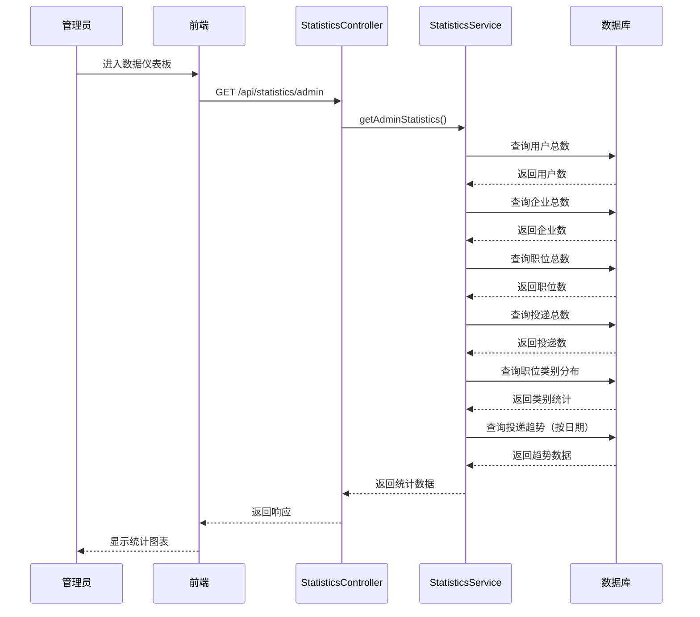
```mermaid
sequenceDiagram
    participant A as 管理员
    participant F as 前端
    participant C as StatisticsController
    participant S as StatisticsService
    participant DB as 数据库

    A->>F: 进入数据仪表板
    F->>C: GET /api/statistics/admin
    C->>S: getAdminStatistics()
    S->>DB: 查询用户总数
    DB-->>S: 返回用户数
    S->>DB: 查询企业总数
    DB-->>S: 返回企业数
    S->>DB: 查询职位总数
    DB-->>S: 返回职位数
    S->>DB: 查询投递总数
    DB-->>S: 返回投递数
    S->>DB: 查询职位类别分布
    DB-->>S: 返回类别统计
    S->>DB: 查询投递趋势（按日期）
    DB-->>S: 返回趋势数据
    S-->>C: 返回统计数据
    C-->>F: 返回响应
    F-->>A: 显示统计图表
```

**统计内容包括：**
- 用户总数、企业总数、职位总数、投递总数
- 职位类别分布（饼图）
- 投递趋势（折线图，按日期统计）
- 企业审核状态分布
- 职位状态分布

### 10.2 企业统计数据流程

```mermaid
sequenceDiagram
    participant E as 企业用户
    participant F as 前端
    participant C as StatisticsController
    participant S as StatisticsService
    participant DB as 数据库

    E->>F: 进入企业数据面板
    F->>C: GET /api/statistics/company
    C->>S: getCompanyStatistics(companyId)
    S->>DB: 查询企业职位数
    DB-->>S: 返回职位数
    S->>DB: 查询企业投递数
    DB-->>S: 返回投递数
    S->>DB: 查询职位总浏览量
    DB-->>S: 返回浏览数
    S->>DB: 查询投递状态分布
    DB-->>S: 返回状态统计
    S-->>C: 返回统计数据
    C-->>F: 返回响应
    F-->>E: 显示统计数据
```

---

## 11. 批量发布流程

### 11.1 批量导入职位流程

```mermaid
sequenceDiagram
    participant A as 管理员
    participant F as 前端
    participant C as JobController
    participant S as JobService
    participant DB as 数据库

    A->>F: 进入批量发布页面
    F->>A: 下载Excel模板
    A->>A: 填写职位数据
    A->>F: 上传Excel文件
    F->>C: POST /api/job/batch-import
    C->>S: batchImportJobs(file)
    S->>S: 解析Excel文件
    S->>S: 验证数据格式
    loop 遍历每行数据
        S->>S: 验证必填字段
        alt 数据无效
            S->>S: 记录错误信息
        else 数据有效
            S->>DB: 插入职位记录
            DB-->>S: 插入成功
        end
    end
    S->>S: 统计成功/失败数量
    S-->>C: 返回导入结果
    C-->>F: 返回响应
    F-->>A: 显示导入结果
```

**流程说明：**
1. 管理员下载Excel模板
2. 填写职位数据
3. 上传Excel文件
4. 后端解析Excel
5. 逐行验证数据
6. 批量插入数据库
7. 返回导入结果（成功数、失败数、失败原因）

---

## 12. 权限验证流程

### 12.1 前端路由权限验证

```mermaid
sequenceDiagram
    participant U as 用户
    participant F as 前端路由守卫
    participant S as Pinia Store
    participant API as 后端API

    U->>F: 访问路由
    F->>F: 检查路由meta
    alt 公开路由
        F-->>U: 直接放行
    else 需要登录
        F->>S: 检查登录状态
        alt 未登录
            F-->>U: 跳转到登录页
        else 已登录
            F->>S: 检查用户信息
            alt 无用户信息
                S->>API: GET /api/user/info
                API-->>S: 返回用户信息
            end
            F->>F: 检查角色权限
            alt 权限不足
                F-->>U: 静默跳转首页，不连续弹无权限提示
            else 权限足够
                F-->>U: 放行
            end
        end
    end
```

**权限检查规则：**
- `requireAdmin`: 仅管理员可访问
- `requireOperator`: 运营或管理员可访问
- `requireCompany`: 企业用户可访问
- `requireUser`: 求职者可访问

### 12.2 后端接口权限验证

```mermaid
sequenceDiagram
    participant C as 客户端
    participant F as JwtAuthenticationFilter
    participant S as Spring Security
    participant A as @PreAuthorize
    participant M as Controller方法

    C->>F: HTTP请求（携带Token）
    F->>F: 提取Token
    alt 无Token
        F-->>C: 401 未认证
    else 有Token
        F->>F: 验证Token有效性
        alt Token无效
            F-->>C: 401 Token过期或无效
        else Token有效
            F->>F: 解析用户信息
            F->>S: 设置SecurityContext
            S->>A: 检查@PreAuthorize注解
            alt 无权限注解
                A->>M: 放行执行
            else 有权限注解
                A->>A: 验证用户角色
                alt 角色匹配
                    A->>M: 放行执行
                else 角色不匹配
                    A-->>C: 403 禁止访问
                end
            end
        end
    end
```

**权限注解示例：**
- `@PreAuthorize("hasRole('ADMIN')")` - 仅管理员
- `@PreAuthorize("hasRole('COMPANY')")` - 仅企业
- `@PreAuthorize("hasAnyRole('OPERATOR', 'ADMIN')")` - 运营或管理员
- `@PreAuthorize("isAuthenticated()")` - 已登录用户

---

## 13. 站内通知流程

### 13.1 通知生成与读取

```mermaid
sequenceDiagram
    participant B as 业务服务
    participant N as NotificationService
    participant DB as user_notification
    participant U as 用户
    participant F as 前端通知页

    B->>N: 投递/面试/Offer状态变化
    N->>DB: 写入通知标题、内容、业务类型
    U->>F: 打开通知页或导航栏
    F->>DB: 查询通知列表和未读数量
    DB-->>F: 返回通知数据
    alt 单条已读
        F->>DB: 标记当前通知已读
    else 全部已读
        F->>DB: 批量更新为已读
    end
```

**当前通知触发点：**
- 企业查看、筛选或更新投递状态。
- 企业安排面试、同意改期、登记面试结果。
- 企业发送Offer、求职者接受/拒绝Offer、Offer过期、企业确认入职。

---

## 附录：核心业务状态码

### 用户状态
| 状态码 | 状态名称 | 说明 |
|--------|----------|------|
| 0 | 禁用 | 用户被禁用，无法登录 |
| 1 | 启用 | 用户正常，可以登录 |

### 企业审核状态
| 状态码 | 状态名称 | 说明 |
|--------|----------|------|
| 0 | 待审核 | 企业首次提交，或已提交资料变更等待运营审核 |
| 1 | 已通过 | 运营审核通过，企业可以发布职位 |
| 2 | 已拒绝 | 运营审核拒绝，需修改后重新提交 |

企业资料重审补充状态：`pending_*` 字段非空表示存在待审核修改；企业点击“提交审核”后岗位会自动下线，审核通过后 `pending_*` 覆盖正式资料并清空。

### 职位状态
| 状态码 | 状态名称 | 说明 |
|--------|----------|------|
| 0 | 待审核 | 职位刚发布 |
| 1 | 已发布 | 运营审核通过，求职者可见 |
| 2 | 已拒绝 | 运营审核拒绝 |
| 3 | 已下线 | 企业主动下线、管理员操作，或企业资料重新提交审核时自动下线 |

### 投递状态
| 状态码 | 状态名称 | 说明 |
|--------|----------|------|
| 0 | 待查看 | 求职者刚投递 |
| 1 | 已查看 | 企业已查看简历 |
| 2 | 感兴趣 | 企业感兴趣，可能面试 |
| 3 | 不合适 | 企业认为不合适 |
| 4 | 面试中 | 企业已安排面试或面试流程未结束 |
| 5 | 面试未通过 | 面试结果未通过 |
| 6 | Offer待确认 | 企业已发送Offer，等待求职者响应 |
| 7 | Offer已接受 | 求职者接受Offer |
| 8 | Offer已拒绝 | 求职者拒绝Offer |
| 9 | 已入职 | 企业确认候选人已入职 |
| 10 | 面试通过 | 终面通过，等待企业发送Offer |
| 11 | Offer已过期 | Offer超过有效期 |

### 面试结果状态
| 状态码 | 状态名称 | 说明 |
|--------|----------|------|
| 0 | 待安排 | 面试已创建，结果未定 |
| 1 | 通过 | 当前轮面试通过 |
| 2 | 未通过 | 当前轮面试未通过 |
| 3 | 已取消 | 当前轮面试取消 |

### Offer状态
| 状态码 | 状态名称 | 说明 |
|--------|----------|------|
| 0 | 待确认 | Offer已发送，等待求职者响应 |
| 1 | 已接受 | 求职者接受Offer |
| 2 | 已拒绝 | 求职者拒绝Offer |
| 3 | 已过期 | Offer超过有效期 |

### 操作类型
| 类型 | 说明 |
|------|------|
| LOGIN | 用户登录 |
| LOGOUT | 用户退出 |
| CREATE | 创建数据 |
| UPDATE | 更新数据 |
| DELETE | 删除数据 |
| QUERY | 查询数据 |
| EXPORT | 导出数据 |
| IMPORT | 导入数据 |
| OTHER | 其他操作 |

---

**文档维护者：** AI 自动化生成  
**最后更新：** 2026-05-24  
**版本：** v1.3
